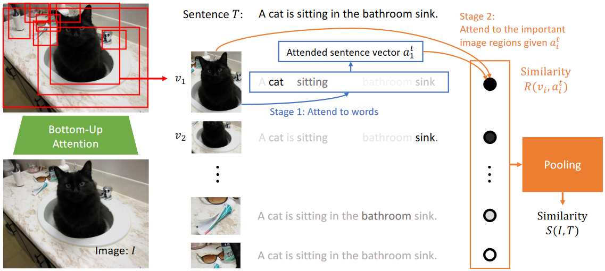

# 1. 引言

## 1.1 背景介绍

随着互联网和移动设备的普及，大量的图像和文本数据被生成和分享。这些数据为多模态学习和跨模态匹配提供了丰富的应用场景。

例如，用户可能希望通过文本描述来检索相应的图像，或者为图像生成描述性文本。为了满足这些需求，研究者开始探索如何有效地在图像和文本之间建立语义关联。

自 2016年以来，多模态（multi-modal）一词在 Google Trends 上的搜索量呈逐年上涨的趋势，这表明多模态学习和跨模态匹配在学术界和工业界都受到了广泛的关注。


同样的，根据 Google Trends 显示，图文匹配（image-text）一词在近几年的搜索量也呈逐年上涨的趋势。


## 1.2 报告的目的和重要性

本报告旨在对基于深度学习的多模态（跨模态）图文匹配进行全面的调研，包括其基本概念、主要技术、应用场景以及最新的研究进展。

通过这次调研，希望能提供一个清晰、系统的了解，以及如何在实际应用中利用这些技术。

多模态图文匹配不仅在学术研究中受到广泛关注，而且在实际应用中也有着广泛的应用前景，如图像检索、自动图像标注、多媒体推荐系统等。
因此，对这一领域的深入了解和研究具有重要的理论和实践意义。

## 1.3 跨模态图文匹配的定义

跨模态图文匹配是指在不同模态（如图像和文本）之间建立语义关联的过程。

在这个背景下，模态通常指的是数据的不同表示形式或来源。图文匹配的目标是找到与给定文本描述相匹配的图像，或者找到与给定图像相匹配的文本描述。

为了实现这一目标，研究者采用了各种深度学习技术，如卷积神经网络、循环神经网络和Transformer结构，来捕捉和理解图像和文本之间的复杂关系。

# 2. 基础知识

## 2.1 深度学习简介

深度学习是机器学习的一个子领域，它主要依赖于神经网络模型，特别是那些具有多层结构的神经网络。这些多层结构使得深度学习模型能够学习和表示数据的复杂特征和抽象。

- **神经网络**：是一种模仿人脑工作机制的算法，由多个节点（或称为“神经元”）组成，这些节点在层与层之间相互连接。

- **卷积神经网络（CNN）**：特别适用于图像处理任务，它可以自动学习图像的空间层次结构特征。

- **循环神经网络（RNN）**：适用于序列数据，如文本或时间序列数据，因为它可以记住先前的输入信息。

- **Transformer结构**：这是一个新的深度学习模型结构，特别适用于自然语言处理任务，如机器翻译和文本生成。

## 2.2 多模态学习与跨模态学习的定义和差异

- **多模态学习**：它涉及到从多种不同的数据来源或模态中学习，例如图像和文本。目标是结合这些不同的模态来提高学习效果。

- **跨模态学习**：它主要关注如何在一个模态中学习到的知识转移到另一个模态。例如，如何将在文本数据上学到的知识应用到图像数据上。

这两者之间的主要差异在于它们的学习目标和所使用的数据。多模态学习旨在结合多种模态，而跨模态学习则关注于在不同模态之间的知识转移。

# 3. 主要挑战

## 3.1 语义鸿沟

CBIR (基于内容的图像检索 Content basedimageretrieval) 的基本思路是：从图像中抽取低层的视觉特征 (如颜色、纹理、形状等), 然后基于这些特征将用户查询的图像与数据库中的图像进行相似程度衡量，图像的相似性判断建立在视觉特征的相似性上。

这些传统的 CBIR 系统的检索结果往往难以令人满意，这主要是因为计算机自动提取的图像视觉特征与人所理解的图像内容存在巨大的差异。人们在查询和判断图像时总要使用一些高层次概念 (如女孩、高兴等), 这些高层次概念包含了人对图像所描述的对象、事件以及表达的情感等内容的理解，而这就是图像所具有的语义特征。

由于目前计算机视觉及人工智能等技术还不够完善，计算机对图像内容的理解与人对图像内容的理解存在着巨大客观差距，这种差距造成了当前 CBIR 系统中必然会存在 “语义鸿沟 (Semanticgap)” 问题 [1]

自该问题提出以来，经过将近 20 年的发展，“语义鸿沟”问题随着 Transformer [2] 和 VIT(Vision Transformer) [3] 技术的兴起逐渐看到了希望。

Transformer 在理解文本语义的同时，拥有更好的迁移能力，这使得大规模预训练的大模型AI成为可能;

同时 VIT 使得计算机能够更好地理解图像内容，从而更好地解决 “语义鸿沟” 问题。

## 3.2 大规模数据集的构建和利用

Krishna Srinivasan 等人介绍了一个基于维基百科的图文数据集 (WIT)，该数据集包含了3750万个实体丰富的图文示例，覆盖了108种维基百科语言。尽管该数据集的规模很大，但它仍然存在一些限制，例如概念和实体的多样性相对于以前的数据集有所提高，但仍然存在挑战。[4]

## 3.4 高效的相似性检索

Gengshen Wu 等人提出了一种自监督的深度多模态哈希方法 (SSDMH)，该方法可以学习不同模态的统一哈希代码和深度哈希函数。尽管该方法在三个基准数据集上的表现优于其他跨媒体哈希方法，但仍然存在优化效率和实时操作方面的挑战。[5]

## 3.5 多模态检索的扩展性

Lu Jin 等人提出了一种深度语义多模态哈希网络 (DSMHN)，该网络可以用于可扩展的图文和视频文本检索。尽管该方法在四个广泛使用的多模态检索数据集上的表现优于其他最先进的方法，但仍然存在将不同类型的损失函数灵活集成到统一的深度多模态哈希框架中的挑战。[6]

## 3.6 社交媒体中的命名实体识别

M. Asgari-Chenaghlu 等人提出了两种利用多模态深度学习和变压器的新颖深度学习方法，用于从社交媒体帖子中进行命名实体识别。尽管这些方法在精度、召回率和F1分数方面的表现优于其他最先进的命名实体识别解决方案，但社交媒体内容的噪声和语言错误仍然是一个挑战。[7]

## 3.7 参考文献

```text
[1] 温超,耿国华.基于内容图像检索中的“语义鸿沟”问题[J].西北大学学报(自然科学版),2005(05):46-50.
[2] A. Vaswani et al., “Attention Is All You Need.” arXiv, Aug. 01, 2023. doi: 10.48550/arXiv.1706.03762.
[3] A. Dosovitskiy et al., “An Image is Worth 16x16 Words: Transformers for Image Recognition at Scale.” arXiv, Jun. 03, 2021. doi: 10.48550/arXiv.2010.11929.
[4] K. Srinivasan, K. Raman, J. Chen, M. Bendersky, and M. Najork, “WIT: Wikipedia-based Image Text Dataset for Multimodal Multilingual Machine Learning,” in Proceedings of the 44th International ACM SIGIR Conference on Research and Development in Information Retrieval, Jul. 2021, pp. 2443–2449. doi: 10.1145/3404835.3463257.
[5] G. Wu, J. Han, Z. Lin, G. Ding, B. Zhang, and Q. Ni, “Joint Image-Text Hashing for Fast Large-Scale Cross-Media Retrieval Using Self-Supervised Deep Learning,” IEEE Transactions on Industrial Electronics, vol. 66, no. 12, pp. 9868–9877, Dec. 2019, doi: 10.1109/TIE.2018.2873547.
[6] L. Jin, Z. Li, and J. Tang, “Deep Semantic Multimodal Hashing Network for Scalable Image-Text and Video-Text Retrievals,” IEEE Transactions on Neural Networks and Learning Systems, vol. 34, no. 4, pp. 1838–1851, Apr. 2023, doi: 10.1109/TNNLS.2020.2997020.
[7] M. Asgari-Chenaghlu, M. R. Feizi-Derakhshi, L. Farzinvash, M. A. Balafar, and C. Motamed, “CWI: A multimodal deep learning approach for named entity recognition from social media using character, word and image features,” Neural Comput & Applic, vol. 34, no. 3, pp. 1905–1922, Feb. 2022, doi: 10.1007/s00521-021-06488-4.
```

# 4. 主要技术和方法

## 4.1 基于特征表示的方法

基于特征表示的方法将基于深度学习的单模态特征提取算法应用在跨模态图文检索中

基于特征表示的方法一般通过两种方式来获取更好的跨模态输入特征：

- 第一种针对不同应用场景，采用特殊的网络结构或提取特定的特征来获得图像文本表示；
- 第二种方法则对经典的CNN 模型进行微调改进。该类方法尤其对大规模、多标签数据集有良好的适应性，可以为未来跨模态检索提供更有效的设计思路。

例如，一些研究人员建立了基于最大似然原则的学习框架，通过反向传播和随机梯度下降算法来优化模型参数，从而更有效地提取文本特征。但是，这种方法在样本数量较少的情况下性能较差，尚未能很好地建立文本数据的低级特征和高级语义间的关系[1]。

然而，目前研究者在该类方法中更倾向于对视觉特征的探索，文本数据在跨模态语义特征提取过程中并没有得到很好的研究。

因此，探索更合适的神经网络以建立文本数据由低级特征到高级语义之间的映射是该类方法所面临的挑战

| 方法         | 特点                                                           | 适用                |
|------------|--------------------------------------------------------------|-------------------|
| MSDS[2]    | 能够更有效地提取文本特征，但对于样本数量较少的情况性能较差                                | 大规模数据集            |
| DeCAF[3]   | 学习到的视觉特征具有足够的表征能力                                            | 单标签或多标签样本 图文跨模态检索 |
| deep-SM[4] | 提高了对目标数据集的适应性，有效降低了图像与相应语义概念之间的鸿沟， 但未能良好建立文本数据的低级特征和高级语义间的关系 | 单标签或多标签样本 图文跨模态检索 |

MSDS:

MSDS 是一种基于特定模态特征学习的新型模型。考虑到不同模态的特征，该模型使用两种类型的卷积神经网络将原始数据分别映射到图像和文本的潜在空间表示中。
其中，用于文本的基于卷积的网络涉及词嵌入学习，这已被证明能有效提取有意义的文本特征，用于文本分类。
在潜空间中，图像和文本的映射特征形成了相关和不相关的图像-文本对，并被 "一对多"学习方案所使用。
这种学习方案通过允许一个相关和多个不相关配对来实现排序功能。标准的反向传播技术用于更新两个卷积网络的参数。

deep-SM:

deep-SM 深度语义匹配方法（deep semantic matching，deep- SM），在对预训练的 CNN 模型进行微调基础上，对不同的目标数据集采用不同的损失函数，使用微调的 CNN 和训练的全连接神经网络将图像和文本投影到高抽象级别的同构语义空间中。
实验表明，微调的方法可以提高其对目标数据集的适应性，有效降低图像与相应语义之间的鸿沟。

具体来说，从 CNN 模型中提取了现成的 CNN 视觉特征，并在 ImageNet 上对来自 1000 个对象类别的 100 多万张图像进行了预训练，以此作为通用图像表征来解决跨模态检索问题。为了进一步提高 CNN 视觉特征的表征能力，我们在 ImageNet 上预训练的 CNN 模型的基础上，针对每个目标数据集使用开源的 Caffe CNN 库进行了微调。此外，我们还提出了一种深度语义匹配方法，以解决带有一个或多个标签的样本的跨模态检索问题。在五个流行的公开数据集上进行的广泛实验充分证明了 CNN 视觉特征在跨模态检索方面的优越性。

## 4.2 基于图文匹配的方法

基于图文匹配的方法主要分为三类：图像-文本对齐的方法、跨模态重构的方法和图文联合嵌入的方法

### 4.2.1 图像-文本对齐的方法

这类方法通常通过学习同一实例不同模态特征之间的关系来推断句子片段与图像区域之间的潜在对齐，进而实现图文匹配。

#### (1) 多模态双向递归神经网络

为了对图像内容及其在自然语言领域的表示同时进行推理，

文献 [5] 提出了多模态双向递归神经网络结构，其核心观点是将句子视为丰富的标签空间，使连续的单词片段对应于图像中某个特定但未知的位置。该模型能够实现对小区域或相对罕见对象的视觉语义对应关系的解释，在图像-句子排序实验中有良好的性能表现。

#### (2) Neural-ImageQA

为了回答关于图像的自然语言问题，

文献 [6] 将问题意图推理、视觉场景理解与单词序列预测任务结合起来，提出了Neural-ImageQA 模型，其中问题与视觉表征一起被输入LSTM 进行联合训练，其语言输出取决于视觉和自然语言输入，通过单词和像素的端到端训练，获取了良好的匹配结果。实验表明该 方法在“单字”变体情况下能实现最佳性能

#### (3) 细粒度的跨模态图文检索

由于图像-文本对齐的方法更关注局部精细的信息，也常用于细粒度的跨模态图文检索任务。

文献 [7] 针对服装领域提出了 FashionBERT 模型，相比于感兴趣区域（region of interest，RoI）模型，时尚文本倾向于描述更精细的信息。FashionBERT 在提取图像表示时将每个图像分割成相同像素的补丁，作为BERT 模型的序列输入，在匹配时将文本标 记和图像补丁序列进行连接。实验表明该方法可以在一定程度上掩盖图像中不相关的信息，减小了检测到无用和重复区域的可能性。

#### (4) 堆叠交叉注意力模型

由于注意力机制模型在图像-文本对齐方法中的良好表现，

文献 [8] 提出了堆叠交叉注意力模型（stacked cross attention network，SCAN）。该模型对图像 RoI 和文本标记执行跨模态匹配，利用注意力机制将每个片段与来自另一模态的所有片段对齐，以区分单词及图像区域的被关注度，有助于捕捉视觉和语言间的细 粒度相互作用，增强匹配能力。该方法可以灵活地发现细粒度对应关系，在多个基准数据集上都获得了最佳性能。

#### (5) 语境感知注意力网络

基于注意力机制的方法大多忽略了全局上下文中出现的多种语义情况。

基于此，文献[9]提出了语境感知注意力网络（context- aware attention network，CAAN），根据全局上下文有选择地关注信息量最大的局部片段，综合了模态间和模态内注意过程，同时执行图像辅助的文本注意和文本辅助的视觉注意，很好地聚合了上下文信 息，捕捉了潜在的模态内相关性，实验表明自适应检索过程中考虑特定上下文能够帮助模型获得更好的检索结果。

#### (6) 循环注意记忆的迭代匹配

针对语义模型的复杂性，

文献[10]提出了基于循环注意记忆的迭代匹配（iterative matching with recurrent attention memory，IMRAM）方法，该方法通过迭代匹配方案逐步更新跨模态注意力核心，挖掘图文间细粒度的对应关系

#### (7) 总结

图像-文本对齐的方法更加关注图像和文本的局部区域片段信息。此类方法的优势在于，通过注意力机制等方式，能够获得更好的细粒度语义区分能力，有效解决多语义、图像问答、图像描述和细粒度交互等问题，进而提高了图文匹配的准确度，具有良好的检索性能。然而，此类方法由于更多聚焦于局部信息，对数据集的规模和质量以及模型的精细度会有更高的要求，且大多并不适用于全局信息的匹配。如何在保证局部片段信息良好对齐的前提下实现图文整体的准确匹配仍是目前需要研究的方向

### 4.2.2 跨模态重构的方法

这类方法通常通过在一个模态上重构另一个模态的信息，以实现模态间的对齐。

#### (1) 解决跨模态相关性非线性问题

由于跨模态相关性是高度非线性的，而 RBM 很难直接对这种相关性进行学习。基于此，考虑在每个模态的预训练层上训练 RBM 的方法

- 文献 [22] 提出不同模态数据共享权重的双模深度自编码器模型，在仅给定视频数据的情况下进行跨模态重建，从而发现跨模态的相关性。
- 在文献 [22] 研究基础上，文献 [23] 提出了一种图像字幕生成的方法，引入了结构-内容神经语言（structure- content neural language model，SCNLM）模型，SC-NLM 通过编码器学习图像句子联合嵌入，并根据编码器产生的分布式表示，将句子的结构与内容分离，再通过解码器生成新的字幕。该模型有效地统一了联合图像-文本嵌入模型和多模态神经语言模型，实现了对图像和字幕的排序及新字幕的生成。

#### (2) 模态对抗语义学习网络

由于源集和目标集实例在不可扩展跨模态检索任务中通常被假定共享相同范围的类，当二者实例具有不相交的类时，难以取得理想的检索结果。

为此，文献 [11] 提出了模态对抗语义学习网络（modal-adversarial semantic learning network， MASLN），其中，跨模态重构子网络通过条件自编码器相互重建各模态数据，实现从源集到目标集的知识转移，使跨模态分布差异最小化；模态对抗语义学习子网络通过对抗性学习机制产生语义表征，使学习到的公共表示对语义有区别而对模态无区别。实验表明，该方法在可扩展和不可扩展的检索任务中结果都优于其他方法，有效缩小了不同模态之间的异质性差距。

#### (3) 循环一致图文检索网络

为了克服对嵌入空间的需求

文献 [12] 提出了循环一致图文检索网络（cycle-consistent text and image retrieval network，CyTIR-Net），将图文检索问题表述为文本和视觉转换的问题。该方法利用文本项和视觉特征的相互翻译建立重构约束，txt2img 和 img2txt 模型分别实现了图像和文本域之间的前向和后向转换，确保重构的文本或图像与原始文本或图像向量相似，并包含足够的重构信息。实验表明该方法对中小型数据集表现更好，良好地展示了循环一致性约束的正则化能力和网络的泛化能力，以及增强模型在跨模态检索中的场景辨别能力。

#### (4) 总结

跨模态重构的方法利用深度自编码器等方式，有效缩小了模态间的异构性差异，增强了语义辨别能力。此类方法对数据集的训练及其规模要求并不高，注释成本低，更适用于中小型数据集，具有可扩展性，多用于图像字幕生成等任务。然而，此类方法在模型训练过程中容易忽略细节信息，对目标数据集成对相关性的表现度不足。因此，如何在缩小模态间统计差距的前提下，共同学习局部文本与图像信息的对齐，并据此来动态地调节模态间的生成过程，是目前此类方法所面临的挑战。

### 4.2.3 图文联合嵌入的方法

这类方法通常通过将图像和文本映射到同一特征空间，以实现模态间的对齐。

#### (1) 解决模态特征的不一致性

针对模态特征的不一致性导致的跨模态迁移困难的问题

文献 [13] 使用弱对齐的数据来学习具有强对齐的跨模态表示，在共享层使用多层感知器将文本信息映射到与视觉模态相同维度的表示空间中。该模型同时用到了微调和统计正则化的方法，可以在训练数据没有明确对齐的情况下跨模态检测相同的概念，具有良好的检索性能。

#### (2) 公共表示空间的学习

为了寻找公共表示空间来直接比较不同模态的样本:

文献 [14] 提出了深度监督跨模态检索（deep supervised cross-modal retrieval， DSCMR）方法，通过最小化样本在标签空间和公共表示空间中的判别损失来监督模型学习判别特征，以保持不同类别语义样本间的区分度，并使用权重共享策略来消除多媒体数据在公共表示空间中的跨模态差异。相比以往的方法，DSCMR 的学习策略可充分利用成对标签信息和分类信息，有效学习了异构数据的公共表示。

#### (3) 充分利用语义信息

以上方法已考虑到不同模态到公共空间的特征映射，但这种映射函数仅关注于学习模态内或模态间的区分特征，而未能在跨模态学习方法中充分利用语义信息。

为此，文献 [15] 提出了基于正则化跨模态语义映射的深度神经网络（regularized deep neural network， RE-DNN），通过施加模态内正则化，进而获得一个联合模型来捕捉不同输入之间的高度非线性关系。该模型在语义层同时捕获模态内和模态间的关系，且所学习的深层架构能够通过停用部分网络来解决模态缺失问题，具有良好处理不成对数据的能力。该算法仅需要很少的模型训练先验知识，且对大规模数据集可扩展。

#### (4) 减小“认知鸿沟”

为了减小低级视觉特征和高级用户概念之间的“认知鸿沟”

文献 [16] 提出了多感官融合网络（multi-sensory fusion network，MSFN）联合模型，将同维CNN 视觉嵌入和 LSTM 描述嵌入看作人类的两种感官，从人类感知角度将视觉和描述性感官相结合。在测试集中的所有图像和文本映射到公共语义空间后，跨模态检索被转化为用传统相似性度量评估的同构检索问题，该方法通过最小化类别损失函数挖掘了跨模态丰富的语义相关性。

#### (5) 解决歧义实例问题

图文联合嵌入方法通常会学习内嵌式嵌入函数（injective embedding functions），对于具有歧义的实例，内嵌函数寻找单个点会严重限制其在现实世界中的应用。

文献 [17] 引入了多义实例嵌入网络（polysemous instance embedding networks，PIE Nets），通过结合输入的全局和局部信息来提取每个实例的 K 个嵌入，同时使用局部Transformer 模块关注输入实例的不同部分，获得局部引导特征表示，并利用残差学习将局部和全局表示结合起来，进而提升特征的判别性。

#### (6) 解决信息映射点丢失问题

针对内嵌函数学习某一模态只能表示对应模态的部分信息，进而导致被忽略信息在映射点丢失的问题

文献 [17] 还提出了多义视觉语义嵌入方法（polysemous visual-semantic embedding，PVSE），在多实例学习框架中对图像和文本 PIE 网络进行联合优化，且该方法通过最大平均差异（maximum mean discrepancy，MMD）[14]来最小化两个嵌入分布之间的差异。实验表明了残差学习和多实例学习对于实例语义模糊数据检索的重要性。

文献 [18] 提出了生成式跨模态学习网络（generative cross- modal feature learning，GXN），将基础表示和抽象表示相结合。除了全局语义层的跨模态特征嵌入外，GXN 还引入了图像到文本和文本到图像两种生成模型的局部跨模态特征嵌入，通过生成过程来学习全局抽象特征及局部基础特征。该方法能够有效处理多义实例问题，并能够检索具有局部相似性的图像或具有词级相似性的句子。

通过引入GAN 网络的对抗思想，文献 [19] 提出了对抗式跨模态检索方法（adversarial cross-modal retrieval，ACMR），该模型在对抗机制下执行语义学习，其中，特征投影器从公共子空间中的不同模态生成模态不变表示，模态分类器根据生成的表示来区分不同的模态，并以这种方式引导特征投影器的学习。通过对特征投影器施加三元组约束，将具有相同语义标签的跨模态表示差异最小化，同时最大化具有不同语义的图像文本之间的距离。该方法在跨模态数据被投影到公共子空间中时，数据的潜在语义结构被更好地保留。

#### (7) 总结

图文联合嵌入的方法更关注对高级语义信息的探索。此类方法一般利用生成对抗等思想，通过最小化判别损失函数和模态不变性损失等方式挖掘丰富的语义相关性，能够很大程度上消除跨模态异构差异，减小“语义鸿沟”及“认知鸿沟”，有效解决多义实例、模态缺失等问题，并能良好地捕获成对信息相关性，提高图文匹配的准确度和可扩展性，具有很好的检索性能。

### 4.2.4 方法总结

下表详细列举了每个类别下具有代表性的方法及其特点。

> 类别:
> - 对齐: 图像-文本对齐的方法
> - 重构: 跨模态重构的方法
> - 嵌入: 图文联合嵌入的方法

| 类别 | 方法              | 特点                                                                         | 适用                   |
|----|-----------------|----------------------------------------------------------------------------|----------------------|
| 对齐 | Neural-Image-QA | 减少了爆炸梯度问题，且单字变体能使获得的准确率翻倍，实现最佳性能，但答案较长时准确率会迅速下降，且在训练数据点太少或图像有强遮挡等情况时容易匹配失败 | 现实世界的图像问答任务          |
| 对齐 | FashionBERT     | 可掩盖图像中的不相关信息，且补丁能提供不重复且合理相关的信息，但需要大 量带注释的图像文本对，在实际场景中不易获得                  | 细粒度的跨模态图文检索任务        |
| 对齐 | CAAN            | 检索速度快，模型小，在部署和应用上更方便实用，然而模态间比对和模态内相 关性的结合要求更精细的模型设计                        | 单词或图像区域在不同全局上下文中多种语义 |
| 对齐 | IMRAM           | 对小规模和大规模数据集都能达到最佳性能，具有鲁棒性                                                  | 考虑语义复杂性的跨模态检索任务      |
| 重构 | SC-NLM          | 训练模型后可在图像嵌入上对模型调节，且能够不断优化对生成新描述的评分 函数，实现对图像和字幕的排序；但不能动态修改用于调节解码器的向量        | 解决图像字幕生成问题           |
| 重构 | MASLN           | 能够有效缩小不同模态间的统计差距，最大化语义区分能力，但训练模型可能不 能很好地反映公共表示中目标集的成对相关性                   | 可扩展跨模态检索任务           |
| 重构 | CyTIR-Net       | 在中小型数据集情况下表现更好，且在训练数据稀缺时能够增强最终检索性能，无需额外注释成本，但在某些情况下无法检索到模态间对应的所有细节信息       | 中小型数据集               |
| 嵌入 | RE-DNN          | 仅需要很少的模型训练先验知识，同时能解决模态缺失问题，且对大规模数据集可扩展                                     | 多媒体信息检索系统            |
| 嵌入 | PVSE            | 克服了被忽略信息在映射点丢失后无法恢复的问题                                                     | 多义实例问题               |
| 嵌入 | GXN             | 能够检索具有局部相似性的图像或具有词级相似性的句子                                                  | 多义实例问题               |

## 4.3 二进制表示学习方法

实值表示学习方法具有良好的语义区分能力，能够很大程度上减小“语义鸿沟”及“认知鸿沟”，因此其检索准确性一般很好，但对于一些对检索效率要求高的任务场景，实值表示学习并不适用。相比于实值表示学习方法，二进制表示学习方法在检索效率上具有优势，其在保证准确率波动幅度可控的前提下，可显著提升检索速度。

二进制表示学习方法更侧重解决模态特征异构引起的模态差异问题，运用端到端、生成对抗等思想，致力于最大化特征分布的一致性。此类方法还有效解决了过拟合等问题。然而由于此类方法在二值化过程中会导致信息的丢失以及原有结构被破坏，考虑模态内数据结构和模态间结构匹配的关联，优化计算等是目前需要研究的方向。

### 4.3.1 二进制哈希编码

二进制哈希编码是一种将数据映射到二进制空间的方法，该方法能够有效缩小不同模态间的统计差距，最大化语义区分能力，但训练模型可能不可扩展跨模态检索任务。

2014 年，文献 [20] 提出了卷积神经网络哈希（convolutional neural network Hashing， CNNH）模型，使基于CNN 的深度哈希算法开始受到关注。

2015 年，文献 [21] 提出二进制哈希码的深度学习（deep learning of binary Hash codes，DLBHC）方法，利用深度 CNN 的增量学习特性，以点的方式进行编码和图像表示，同时学习特定图像表征和类似哈希的函数，实现了快速图像检索并使其适用于大规模数据集。

为了进一步探索多标签关联图像的复杂多级语义结构，文献 [24] 提出深度语义哈希排序（deep semantic ranking Hashing，DSRH）方法，利用深度 CNN 与列表排序监督哈希，共同学习特征表示和从它们到哈希码的映射，避免了传统方法特征语义表示能力不足的限制。

文献 [26] 提出了深度视觉语义哈希（deep visual semantic Hashing，DVSH）模型，该模型是首个跨模态哈希的端到端学习方法，设计了学习图文联合嵌入的视觉语义融合网络，以桥接不同模态及两个模态特定的哈希网络，其生成的紧凑哈希码能够捕捉视觉数据和自然语言之间的内在对应关系，进而获取判别性特征，且该模型有效克服了传统融合网络对双峰对象联合嵌入的需求，更适用于高精度的应用程序。

针对跨模态哈希（cross-modal Hashing，CMH）手工制作特性与哈希码学习不能良好兼容的问题，文献 [27] 介绍了跨模态深度哈希算法（deep cross-modal Hashing，DCMH），将特征学习和哈希码学习集成到同一端到端学习框架，通过同时对不同类型样本对施加约束使相似样本间相互靠近，从而保证模态间的对齐，且DCMH 直接学习离散的哈希码，避免了检索准确性的降低，提高了检索性能

### 4.3.2 多源信息复合哈希算法

为确保哈希码和不同信息源所设计哈希函数的一致性，文献 [25] 提出了多源信息复合哈希算法（composite Hashing with multiple information sources， CHMIS），通过调整权重的信息集成方法（CHMIS with adjusted weights，CHMIS-AW）调整每个单独源的权重，将来自不同源的信息集成到二进制哈希码中，进而最大化编码性能，保留了训练示例之间的语义相似性。

### 4.3.3 对抗式哈希

为了弥补模态差异以进一步提高检索准确度，文献 [28] 提出了自我监督的对抗式哈希方法（selfsupervised adversarial Hashing，SSAH），将对抗式学习以自监督方式结合到跨模态哈希中，由自监督语义生成网络（LabNet）和图像文本对抗网络（ImgNet 和 TexNet）组成。其中，自监督语义生成网络用来监督两个模态的语义空间以及对抗性学习。两个对抗网络用来共同学习不同模态的高维特征及其对应的哈希码。实验表明，SSAH 比 DCMH 减少了 90%的训练时间，且SSAH 学习了更充分的监督信息，可以捕获不同模态间更精确的相关性。

### 4.3.4 生成式哈希

针对跨模态哈希在有限数量标记样本上容易过拟合以及高维输入转换成二进制代码导致的信息丢失问题，文献[29]提出了循环一致的深层生成哈希算法（cycle-consistent deep generative Hashing，CYC-DGH），通过循环一致的对抗学习在没有成对对应的情况下学习耦合的生成哈希函数。该算法通过深度生成模型从哈希码中重新生成输入，使学习到的哈希码最大限度地关联每个输入 - 输出对应关系，且哈希嵌入过程中的信息损失被最小化，有效压缩了输入数据，同时能够最大限度地保留自身信息及不同模态样本间的关系，对减小哈希函数间的模态差异有良好表现。

### 4.3.5 方法总结

这些方法通过不同的方式，例如深度视觉语义哈希、多源信息复合哈希等，实现了数据的二进制表示，从而提高了跨模态图文检索的准确性和效率。

下表详细列举了具有代表性的方法及其特点。

| 方法      | 特点                                      | 适用                       |
|---------|-----------------------------------------|--------------------------|
| DVSH    | 有效克服了传统融合网络对双峰对象联合嵌入的需求，对参数选择具有鲁棒性      | 适用高精度，同时能容忍较少最佳检索结果的应用程序 |
| DCMH    | 直接学习离散的哈希码，避免了对所学习哈希码准确性的降低，但所需训练时间长    | 大规模数据集上的人工神经网络搜索         |
| SSAH    | 训练时间短，可捕获更精确的模态间相关性                     | 大规模数据集上的人工神经网络搜索         |
| CYC-DGH | 可以有效压缩输入数据，同时能最大限度地保留其自身信息及来自不同模态的样本间关系 | 有限数量标记样本的跨模态检索任务         |

## 4.4 参考文献

特殊备注：若引用前面有 `(CXXXX)`，则表示该文献被引用（`Cite`）了多次，`XXXX`表示被引用的次数。

```text
[1] LIU Ying, GUO Yingying, FANG Jie, FAN Jiulun, HAO Yu, LIU Jiming. Survey of Research on Deep Learning Image-Text Cross-Modal Retrieval[J]. Journal of Frontiers of Computer Science and Technology, 2022, 16(3): 489-511.
[2] WANG J, HE Y H, KANG C C, et al. Image-text cross-modal retrieval via modality-specific feature learning[C]//Proceedings of the 5th ACM on International Conference on Multimedia Retrieval, Shanghai, Jun 23-26, 2015. New York: ACM, 2015: 347-354.
[3] LIZ, LU W, BAO E, et al. Learning a semantic space by deep network for cross-media retrieval[C]//Proceedings of the 21st International Conference on Distributed Multimedia Systems, Vancouver, Aug 31-Sep 2, 2015. Skokie: Knowledge Systems Institute, 2015: 19-203.
[4] WEI Y, ZHAO Y, LU C, et al. Cross- modal retrieval with CNN visual features: a new baseline[J]. IEEE Transactions on Cybernetics, 2017, 47(2): 449-460.
[5] KARPATHY A, LI F F. Deep visual-semantic alignments for generating image descriptions[C]//Proceedings of the 2015 IEEE Conference on Computer Vision and Pattern Recognition, Boston, Jun 8-10, 2015 . Washington: IEEE Computer Society, 2015: 3128 -3137. 
[6] MALINOWSKI M, ROHRBACH M, FRITZ M. Ask your neurons: a neural-based approach to answering questions about images[C]//Proceedings of the 2015 IEEE International Conference on Computer Vision, Santiago, Dec 7-13, 2015 . Washington: IEEE Computer Society, 2015: 1-9. 
[7] GAO D H, JIN L B, CHEN B, et al. FashionBERT: text and image matching with adaptive loss for cross-modal retrieval [C]//Proceedings of the 43rd International ACM SIGIR Conference on Research and Development in Information Retrieval, Jul 25-30, 2020 . New York: ACM, 2020: 2251 2260.
[8] LEE K H, CHEN X, HUA G, et al. Stacked cross attention for image-text matching[C]//LNCS 11208: Proceedings of the 15th European Conference on Computer Vision, Munich, Sep 8-14, 2018 . Cham: Springer, 2018: 212-228. 
[9] ZHANG Q, LEI Z, ZHANG Z X, et al. Context-aware attention network for image-text retrieval[C]//Proceedings of the 2020 IEEE/CVF Conference on Computer Vision and Pattern Recognition, Seattle, Jun 16-20, 2020 . Piscataway: IEEE, 2020: 3533 -3542. 
[10] CHEN H, DING G G, LIU X D, et al. IMRAM: iterative matching with recurrent attention memory for cross- modal image- text retrieval[C]//Proceedings of the 2020 IEEE/CVF Conference on Computer Vision and Pattern Recognition, Seattle, Jun16-20, 2020 . Piscataway: IEEE, 2020: 12652-12660.
(C0034) [11] XU X, SONG J K, LU H M, et al. Modal-adversarial semantic learning network for extendable cross- modal retrieval[C]// Proceedings of the 2018 ACM on International Conference on Multimedia Retrieval, Yokohama, Jun 11-14, 2018 . New York: ACM, 2018: 46-54. 
(C0010) [12] CORNIA M, BARALDI L, TAVAKOLI H R, et al. A unified cycle-consistent neural model for text and image retrieval[J]. Multimedia Tools and Applications, 2020, 79(35): 25697 25721. 
(C0176) [13] CASTREJÓN L, AYTAR Y, VONDRICK C, et al. Learning aligned cross-modal representations from weakly aligned data[C]//Proceedings of the 2016 IEEE Conference on Computer Vision and Pattern Recognition, Las Vegas, Jun 2730, 2016 . Washington: IEEE Computer Society, 2016: 2940 2949. 
(C0320) [14] ZHEN L L, HU P, WANG X, et al. Deep supervised crossmodal retrieval[C]//Proceedings of the 2019 IEEE/CVF Conference on Computer Vision and Pattern Recognition, Long Beach, Jun 15-20, 2019 . Piscataway: IEEE, 2019: 10394 10403.
(C0061) [15] WANG C, YANG H J, MEINEL C. Deep semantic mapping for cross-modal retrieval[C]//Proceedings of the 27th International Conference on Tools with Artificial Intelligence, Vietri sul Mare, Nov 9-11, 2015. Washington: IEEE Computer Society, 2015: 234-241.
(C0016) [16] FAN M D, WANG W M, DONG P L, et al. Cross-media retrieval by learning rich semantic embeddings of multimedia [C]//Proceedings of the 2017 ACM on Multimedia Conference, Mountain View, Oct 23-27, 2017 . New York: ACM, 2017: 1698 -1706.
(C0225) [17] SONG Y, SOLEYMANI M. Polysemous visual- semantic embedding for cross-modal retrieval[C]//Proceedings of the 2019 IEEE Conference on Computer Vision and Pattern Recognition, Long Beach, Jun 15-20, 2019. Piscataway: IEEE, 2019: 1979 -1988. 
(C0398) [18] GU J X, CAI J F, JOTY S R, et al. Look, imagine and match: improving textual-visual cross-modal retrieval with generative models[C]//Proceedings of the 2018 IEEE Conference on Computer Vision and Pattern Recognition, Salt Lake City, Jun18-22, 2018 . Piscataway: IEEE, 2018: 7181 -7189. 
(C0703) [19] WANG B K, YANG Y, XU X, et al. Adversarial cross-modal retrieval[C]//Proceedings of the 2017 ACM on Multimedia Conference, Mountain View, Oct 23-27, 2017 . New York: ACM, 2017: 154-162.
(C1029) [20] XIA R K, PAN Y, LAI H J, et al. Supervised Hashing for image retrieval via image representation learning[C] ceedings of the 28th AAAI Conference on Artificial Intelligence, Québec, Jul 27-31, 2014 . Menlo Park: AAAI, 2014: 2156-2162.//Pro-
(C0708) [21] LIN K, YANG H F, HSIAO J H, et al. Deep learning of binary Hash codes for fast image retrieval[C]//Proceedings of the 2015 IEEE Conference on Computer Vision and Pattern Recognition Workshops, Boston, Jun 7-12, 2015 . Washington: IEEE Computer Society, 2015: 27-35.
(C2790) [22] NGIAM J, KHOSLA A, KIM M, et al. Multimodal deep learning[C]//Proceedings of the 28th International Conference on Machine Learning, Bellevue, Jun 28- Jul 2, 2011 . Madison: Omnipress, 2011: 689-696. 
(C0155) [23] KIROS R, SALAKHUTDINOV R, ZEMEL R S. Unifying visual-semantic embeddings with multimodal neural language models[J]. arXiv: 1411. 2539, 2014 .
(C0677) [24] ZHAO F, HUANG Y Z, WANG L, et al. Deep semantic ranking based Hashing for multi- label image retrieval[C]// Proceedings of the 2015 IEEE Conference on Computer Vision and Pattern Recognition, Boston, Jun 8-10, 2015 . Washington: IEEE Computer Society, 2015: 1556 -1564. 
(C0237) [25] ZHANG D, WANG F, SI L. Composite Hashing with multiple information sources[C]//Proceeding of the 34th International ACM SIGIR Conference on Research and Development in Information Retrieval, Beijing, Jul 25-29, 2011 . New York: ACM, 2011: 225-234. 
(C0276) [26] CAO Y, LONG M S, WANG J M, et al. Deep visual-semantic Hashing for cross-modal retrieval[C]//Proceedings of the 22nd ACM SIGKDD International Conference on Knowledge Discovery and Data Mining, San Francisco, Aug 13-17, 2016 . New York: ACM, 2016: 1445 -1454. 
(C0693) [27] JIANG Q Y, LI W J. Deep cross-modal Hashing[C]//Proceedings of the 2017 IEEE Conference on Computer Vision and Pattern Recognition, Honolulu, Jul 21-26, 2017 . Washington: IEEE Computer Society, 2017: 3270 -3278. 
(C0398) [28] LI C, DENG C, LI N, et al. Self-supervised adversarial Hashing networks for cross-modal retrieval[C]//Proceedings of the2018 IEEE/CVF Conference on Computer Vision and Pattern Recognition, Salt Lake City, Jun 18-22, 2018 . Piscataway: IEEE, 2018: 4242 -4251. 
(C0224) [29] WU L, WANG Y, SHAO L. Cycle-consistent deep generative Hashing for cross-modal retrieval[J]. IEEE Transactions on Image Processing, 2019, 28(4): 1602 -1612.
```

# 5. 应用前景

## 5.1 公安领域的应用

跨模态图文检索在公安领域主要用于网络舆情分析和网络舆论欺诈。

### 5.1.1 对于突发事件的监测

文献[1]构建了国民安全突发事件检测系统，通过多模态图融合和话题恢复算法对突发事件进行检测，并利用国民安全突发事件分类模块过滤得到相关突发事件

### 5.1.2 对于网络舆情分析

文献[2]提出基于文本的情感显著性特征提取方法和基于图文融合的跨模态舆情回归分析方法，将情感信息融入特征提取得到有利于文本情感分析的显著特征，并进行图文融合以解决模态间情感互斥问题。

文献[3]提出了深度多模态注意融合（deep multi-modal attention fusion，DMAF）模型，利用视觉和语义间的区别性特征和内在相关性，用视觉注意机制自动聚焦情感区域，语义注意机制突出情感相关词，分别捕捉最具辨别力的文本词和视觉区域，然后由基于中间融合的多模态注意模型联合情感分类，最后采用后期融合方案将三种注意力模型结合起来进行情感预测。

文献[4]研究了图文特征联合的证据图像检索技术，其工作原理如下图所示，通过联合视觉和文本特征，在媒体上检索与网络舆论欺诈所用场景内容相似的图像，将此作为物证来实现对图像式网络舆论欺诈的反制。


### 5.1.3 参考文献

```text
[1] HE Y J. Social network cross-media national security incidents semantic study and behavioral analysis[D]. Beijing: Beijing University of Posts and Telecommunications, 2018.
[2] SHEN Z Q. Research on public opinion analysis methods based on text and image[D]. Zhenjiang: Jiangsu University, 2018.
[3] HUANG F R, ZHANG X M, ZHAO Z H, et al. Image-text sentiment analysis via deep multimodal attentive fusion[J]. Knowledge-Based Systems, 2019, 167: 26-37.
[4] QIAO F C. Research on the technology of evidence images retrieval using visual and text features[D]. Changsha: National University of Defense Technology, 2013.
```

## 5.2 传媒领域的应用

跨模态图文检索技术在传媒领域主要应用于多媒体事件检测（multimedia event detection，MED）、 意见挖掘以及网络推荐系统等。

### 5.2.1 多媒体事件检测

多媒体事件检测一般需要从视频档案中找到特定事件的视频，并给出示例视频及事件描述，与之相关联的多媒体分类任务需要挖掘示例视频以学习最具区别性的特征，通过多个互补特征的组合获得最佳性能。

文献[1]介绍了双融合的多模态方案，在对多模态特征提取后，通过早期融合和晚期融合的结合来实现不同特征的结合。


### 5.2.2 意见挖掘

意见挖掘是指从用户的评论中提取有用的信息，例如用户对产品或服务的看法、偏好和建议。

文献[2]为了判断情感极性，主要研究了图文联合的情感预测问题，将两个单独的CNN 架构用于学习文本和视觉特征，并将其组合作为另一个多头CNN 架构的输入，应用于文本和图像间的内部关系，最后在两个类别（正或负）标签上产生分布。该方法在多媒体情感分析中取得了良好的效果。

文献[3]为了结合用户数据，提出了多特征融合的微博图文情感分析方法，构造了基于参数迁移和微调图像的情感分类模型，并为文本和图像情感分类模型设计特征层和决策层融合的方法。该方法结合了内容特征和用户特征，有效增强了模型捕捉情感语义的能力。

文献[4]受媒体中图文数据间存在强烈语义关联的启发，提出了端到端的深度融合卷积神经网络，从训练实例中联合学习文本和视觉情感表示，将两种模态信息融合在汇聚层中，以预测情感极性

文献[5]通过对媒体数据的分析发现准确的话题热点，基于社交网络媒体数据提出了多模态融合的话题发现算法，通过在文本和图像上分别发掘潜在主题模型，构建文本图和视觉图，并对两个图进行语义融合得到多模态图，最后在多模态图上通过聚类和回归得到最终话题发现结果

### 5.2.3 网络推荐系统

网络推荐系统是指根据用户的历史行为和偏好，为用户推荐感兴趣的内容。

文献[6]设计了一个关系生成深度信念网络模型（relational generative deep belief nets，RGDBN），将非参数贝叶斯模型印度自助餐过程（Indian buffet process， IBP）集成到修改后的深度信念网络，学习能嵌入媒体内容和媒体关系的潜在特征。IBP 的核心思想是一个数据点可以拥有多个隐性特征，且这些特征概率和不为 1。该模型能够分析异构和同构数据间的联系并进行跨模态检索，可以通过社交媒体应用到用户推荐中。

### 5.2.4 字幕生成

文献[7]，文献[8]和文献[9]利用跨模态特征表示及跨模态重构的方法实现了图像或视频的字幕生成。

### 5.2.5 参考文献

```text
[1] LAN Z Z, BAO L, YU S I, et al. Multimedia classification and event detection using double fusion[J]. Multimedia Tools & Applications, 2014, 71(1): 333-347.
[2] CAI G Y, XIA B B. Convolutional neural networks for multimedia sentiment analysis[C]//LNCS 9362: Proceedings of the4th CCF Conference on Natural Language Processing and Chinese Computing, Nanchang, Oct 9-13, 2015 . Cham: Springer, 2015: 159-167.
[3] LIN H B, MIAO Y Q, ZHANG W Z, et al. Multimedia sentiment analysis on microblog based on multi-feature fusion [J]. Application Research of Computers, 2020, 37(7): 1935 1939.
[4] CHEN X Y, WANG Y H, LIU Q J. Visual and textual sentiment analysis using deep fusion convolutional neural networks[C]//Proceedings of the 2017 IEEE International Conference on Image Processing, Beijing, Sep 17-20, 2017 . Piscataway: IEEE, 2017: 1557-1561.
[5] ZHANG Y Y, LI G R, CHU L Y, et al. Cross- media topic detection: a multi- modality fusion framework[C]//Proceedings of the 2013 IEEE International Conference on Multimedia and Expo, San Jose, Jul 15-19, 2013 . Washington: IEEE Computer Society, 2013: 1-6.
[6] UAN Z Q, SANG J T, LIU Y, et al. Latent feature learning in social media network[C]//Proceedings of the 21st ACM International Conference on Multimedia, Barcelona, Oct 2125, 2013 . New York: ACM, 2013: 253-262.
[7] KIROS R, SALAKHUTDINOV R, ZEMEL R S. Unifying visual-semantic embeddings with multimodal neural language models[J]. arXiv:1411.2539,2014.
[8] INYALS O, TOSHEV A, BENGIO S, et al. Show and tell: a neural image caption generator[C]//Proceedings of the 2015 IEEE Conference on Computer Vision and Pattern Recognition, Boston, Jun 8-10, 2015 . Washington: IEEE Computer Society, 2015: 3156 -3164.
[9] VENUGOPALAN S, XU H, DONAHUE J, et al. Translating videos to natural language using deep recurrent neural networks[J]. arXiv: 1412. 4729, 2014.
```

## 5.3 医学领域的应用

跨模态图文检索技术在医学领域主要应用于医学图像检索、医学图像标注和医学图像分类等。

### 5.3.1 医学图像检索

文献[1]提出跨模态生物医学图像多标签分类算法，通过融合图像内容和说明文本，运用迁移学习技术，有效地识别了复合医学图像中的信息，进而提高了图像检索性能。

作为现有医学图像数据处理的典型技术，医学影像存档与通信系统（picture archiving and communication systems，PACS）可以对医学图像数据进行获取、存储、检索和展示[2]，该系统在查询时，通过输入关键字在关系数据库中对相关字段进行查询，找出了文件系统中对应的医学影像。

### 5.3.2 参考文献

```text
[1] YU Y H, LIN H F, MENG J N, et al. Classification modeling and recognition for cross modal and multi-label biomedical image[J]. Journal of Image and Graphics, 2018, 23(6): 917-927.
[2] OOKE R E, GAETA M G, KAUFMAN D M, et al. Picture archiving and communication system: US6574629 B1[P]. 2003-06-03.
```

## 5.4 自动图像标注

自动图像标注是指为图像自动生成描述性文本。这种技术可以帮助用户理解图像内容，特别是在他们无法直接查看图像的情况下。

例如，为视觉受损的用户提供图像描述。此外，自动生成的标注还可以用于图像搜索和分类。

## 5.5 辅助无障碍技术

跨模态图文匹配技术为辅助无障碍技术提供了强大的支持。

例如，为视觉受损的用户提供图像的文本描述，帮助他们理解周围的环境。此外，这种技术还可以用于为听力受损的用户提供视频的文本描述。

# 6. 国内外研究进展

## 6.1 相关论文

### 6.1.1 用于图像-文本匹配的堆叠交叉注意力

> Stacked Cross Attention for Image-Text Matching
> - 发表年份: 2018
> - 论文链接: [Stacked Cross Attention for Image-Text Matching](https://www.sciencedirect.com/science/article/pii/S0889157522005828)
> - 论文PDF: [Kuang-Huei_Lee_Stacked_Cross_Attention_ECCV_2018_paper.pdf](https://openaccess.thecvf.com/content_ECCV_2018/papers/Kuang-Huei_Lee_Stacked_Cross_Attention_ECCV_2018_paper.pdf)
> - DOI: 10.48550/arXiv.1803.08024
> - Github: https://github.com/kuanghuei/SCAN

摘要:

在本文中，我们研究了图像-文本匹配问题。推断物体或其他突出事物（如雪、天空、草坪）与句子中相应词语之间的潜在语义一致性，可以捕捉视觉与语言之间细微的相互作用，并使图像-文本匹配更具可解释性。之前的研究要么只是简单地汇总所有可能的区域和词对的相似性，而不对较重要和不太重要的词或区域进行区别对待，要么就是使用多步注意过程来捕捉数量有限的语义排列，这就降低了可解释性。在本文中，我们提出了堆叠交叉注意法（Stacked Cross Attention），利用句子中的图像区域和单词作为上下文来发现完整的潜在排列，并推断图像与文本的相似性。我们的方法在 MSCOCO 和 Flickr30K 数据集上取得了最先进的结果。在 Flickr30K 数据集上，我们的方法在通过图像查询进行文本检索方面比目前最好的方法高出 22.1%，在通过文本查询进行图像检索方面比目前最好的方法高出 18.2%（基于 Recall@1）。在 MS-COCO 上，我们的方法在句子检索方面提高了 17.8%，在图像检索方面提高了 16.6%（基于使用 5K 测试集的 Recall@1）。代码发布于：https://github.com/kuanghuei/SCAN.

笔记:

可以发现人们在描述性句子中，经常会提到图像中一些特定但未知的突出区域，以及它们的属性和动作。推理其背后的对应关系是实现可解释的图像-文本匹配的关键


作者引入了一种新颖的堆叠交叉注意力（Stacked Cross Attention），它能在两个阶段中同时关注图像和句子的上下文。

Image-Text 方案（在给定图像和句子的情况下）:

- 首先关注句子中与每个图像区域相关的单词
- 然后将每个图像区域与句子中的关注信息进行比较，以决定图像区域的重要性（例如是否在句子中被提及）

Text-Image 方案（在给定图像和句子的情况下）:

- 首先关注与每个单词相关的图像区域
- 然后决定对每个单词给予更多或更少的关注

这种方法的优点如下:

1. 堆叠交叉注意同时发现所有可能的排列
2. 推断出的对应关系更全面
3. 图像-文本匹配的可解释性更高

作者使用 Faster R-CNN 来实际实现自下而上的注意力，它是自下而上注意力机制的自然表达。大致的流程如下:

1. 从自下而上的注意力开始，检测图像区域并将其**编码为特征**
2. 将句子中的单词和句子上下文**映射为特征**
3. 应用堆叠交叉注意力，通过对齐图像区域和单词特征来**推断图像与句子的相似性**

相关图片:

<div class="custom-paper-image-group">




</div>

### 6.1.2 图像-文本匹配的视觉语义推理

> Visual Semantic Reasoning for Image-Text Matching
> - 发表年份: 2019
> - 论文链接: [Visual Semantic Reasoning for Image-Text Matching](https://openaccess.thecvf.com/content_ICCV_2019/html/Li_Visual_Semantic_Reasoning_for_Image-Text_Matching_ICCV_2019_paper.html)
> - 论文PDF: [Visual Semantic Reasoning for Image-Text Matching](https://openaccess.thecvf.com/content_ICCV_2019/papers/Li_Visual_Semantic_Reasoning_for_Image-Text_Matching_ICCV_2019_paper.pdf)
> - DOI: 无

摘要:

图像-文本匹配一直是连接视觉和语言领域的热门研究课题。由于当前的图像表示通常缺乏全局性的语义概念，就像相应的文字说明一样，因此它仍然具有挑战性。为了解决这个问题，我们提出了一个简单且可解释的推理模型，用于生成能捕捉场景中关键对象和语义概念的视觉表征。具体来说，我们首先建立图像区域之间的联系，并利用图卷积网络进行推理，生成具有语义关系的特征。然后，我们建议使用门和记忆机制，对这些关系增强的特征进行全局语义推理，筛选出具有区分度的信息，并逐步生成整个场景的表征。实验验证了我们的方法在 MS-COCO 和 Flickr30K 数据集的图像-文本匹配方面达到了新的一流水平。在 MS-COCO 数据集上，它在图像检索方面比目前最好的方法高出 6.8%，在标题检索方面比目前最好的方法高出 4.8%（使用 1K 测试集的 Recall@1）。在 Flickr30K 数据集上，我们的模型在图像检索方面提高了 12.6%，在标题检索方面提高了 5.8%（Recall@1）

笔记:

现有方法缺乏全局推理机制，无法在更远的区域之间进行信息沟通。

本文提出了视觉语义推理网络（Visual Semantic Reasoning Network，VSRN），以生成同时捕捉对象及其语义关系的视觉表示。

从识别图像中的突出区域开始，VSRN 通过图卷积网络（Graph Convolutional Network，GCN）进行推理，生成具有语义关系的特征。

然后，在这些突出区域之间建立联系，并利用图卷积网络（GCN）进行推理，生成具有语义关系的特征。

再利用门和记忆机制，对这些关系增强的特征进行全局语义推理，筛选出具有区分度的信息，并逐渐增加对整个场景的表征。

除此之外，还设计了一种解释方法，用于分析推理模型内部所学到的内容。最终图像表征与每个区域特征之间的相关性以注意力的形式可视化。

如下图所示，学习到的图像表征在这些包含关键语义概念的区域有很高的响应度


### 6.1.3 为图像-文本匹配任务学习双分支神经网络

> Learning Two-Branch Neural Networks for Image-Text Matching Tasks
> - 发表年份: 2018
> - 论文链接: [Learning Two-Branch Neural Networks for Image-Text Matching Tasks](https://ieeexplore.ieee.org/abstract/document/8268651)
> - DOI: 10.1109/TPAMI.2018.2797921

摘要:

图像语言匹配任务最近在计算机视觉领域引起了广泛关注。这些任务包括图像-句子匹配（即给定图像查询，检索相关句子，反之亦然）和区域-短语匹配或视觉接地（即将短语与相关区域匹配）。本文研究了用于学习这两种数据模式之间相似性的双分支神经网络。我们提出了两种产生不同输出表征的网络结构。第一个网络被称为嵌入网络，它利用最大边际排序损失和新颖的邻域约束学习显式共享潜在嵌入空间。与标准的三元组采样相比，我们在构建迷你批次时考虑了邻域信息，进行了改进的邻域采样。第二个网络结构被称为 "相似性网络"，它通过元素乘积将两个分支融合在一起，并通过回归损失训练来直接预测相似性得分。广泛的实验表明，我们的网络在 Flickr30K Entities 数据集上的短语定位以及 Flickr30K 和 MSCOCO 数据集上的双向图像-短语检索方面都取得了很高的准确率。

笔记:

> 主要的挑战

在将文本与图像匹配时，可能会遇到一些挑战。首先，图像和文本的表示形式不同，图像是由像素值构成的，而文本是由单词或字符组成的。因此，需要将不同的数据模态转换为统一的特征空间，以便进行匹配。其次，由于语义信息的差异，图像和文本之间存在不对齐的问题，即一张图像可能对应多个不同的文本描述，反之亦然。这种多样性使得匹配变得困难。

在将文本与图像匹配时，词频的不平衡也会对这个过程产生影响。在自然语言中，一些词汇的频率要远高于其他词汇。例如，一些常用的功能词（如“is”、“the”、“and”）和停用词（如“a”、“an”、“in”）在文本中频繁出现，而其他更具特定性的词汇可能出现较少。这种不平衡的词频分布会导致匹配的困难，因为在文本表示中，常见词汇的权重可能过高，而不常见的词汇可能被忽略。

为了解决这个问题，需要在文本表示中考虑词频的影响。一种常用的方法是使用TF-IDF（Term Frequency-Inverse Document Frequency）来加权表示文本，以便更好地捕捉具有更高区分度的词汇。此外，还可以使用词嵌入技术（如Word2Vec、GloVe等）来学习词汇的分布式表示，以便更好地处理不平衡的词频。通过这些方法，可以减少不常见词汇的影响，更好地捕捉文本的语义信息，并促进文本与图像的匹配过程。

> 本文的贡献

主要提出的方法是使用两个分支的神经网络进行图像和文本的匹配。

嵌入网络通过将图像和文本数据映射到一个共享的嵌入空间来测量它们之间的语义相似度

相似性网络则通过元素级乘积将两个分支的特征聚合到一个向量中，并通过回归损失训练来直接预测相似度得分。这种方法比使用单独的分类器更适合，因为它能够更好地捕捉图像和文本之间的高级语义关系，同时也减少了训练和推理的复杂度。

> 双分支网络的架构

以短语定位任务为例展示本文使用的双分支网络的架构。

左列：给定图像标题中的短语 "一个火坑"，从训练图像中提取正区域（紫色）和负区域（蓝色）。正区域是指与地面实况（白色虚线矩形）有足够高重叠度的区域。
X 和 Y 分别表示描述图像区域和短语的特征向量。在本文中，X 是从预先训练的 VGG 网络中提取的特征，Y 是无序 Fisher 向量文本特征 [2]。

中间：嵌入网络。每个分支都由全连接（FC）层组成，层与层之间有 ReLU 非线性，最后进行 L2 归一化。
我们使用最大边际三元组排序损失来训练该网络，该损失会使正对更接近，负对更接近（第 3.2 节）。

右列：相似性网络。与嵌入网络一样，分支由两个全连接层组成，然后进行 L2 归一化。元素乘积用于聚合来自两个分支的特征，然后是几个额外的全连接（FC）层。
相似性网络使用逻辑回归损失函数进行训练，正负图像文本对分别获得 "+1 "和"-1 "的标签


## 6.2 公开数据集

### 6.2.1 Flickr30K

> - 官网: http://shannon.cs.illinois.edu/DenotationGraph/
>
> - 相关论文: From image descriptions to visual denotations: New similarity metrics for semantic inference over event descriptions
>
> - 相关论文PDF: http://shannon.cs.illinois.edu/DenotationGraph/TACLDenotationGraph.pdf

简介: Flickr30k 数据集包含从 Flickr 收集的 31000 张图像，以及人工注释者提供的 5 个参考句子。

格式: <图像文件名>#<标题编号> <标题>; 一个图像文件名对应 5 个标题，每个标题编号从 0 到 4。

```
<图像文件名>#<标题编号> <标题>
1000092795.jpg#0	Two young guys with shaggy hair look at their hands while hanging out in the yard .
1000092795.jpg#1	Two young , White males are outside near many bushes .
1000092795.jpg#2	Two men in green shirts are standing in a yard .
1000092795.jpg#3	A man in a blue shirt standing in a garden .
1000092795.jpg#4	Two friends enjoy time spent together .
10002456.jpg#0	Several men in hard hats are operating a giant pulley system .
10002456.jpg#1	Workers look down from up above on a piece of equipment .
10002456.jpg#2	Two men working on a machine wearing hard hats .
10002456.jpg#3	Four men on top of a tall structure .
10002456.jpg#4	Three men on a large rig .
```


### 6.2.2 NUS-WIDE

> - 官网: https://lms.comp.nus.edu.sg/wp-content/uploads/2019/research/nuswide/NUS-WIDE.html
> - 相关论文: NUS-WIDE: A real-world web image database from National University of Singapore
> - 相关论文PDF: https://lms.comp.nus.edu.sg/wp-content/uploads/2019/research/nuswide/nuswide-civr2009.pdf

NUS-WIDE 是由新加坡国立大学多媒体检索实验室创建的网络图像数据集，其图像主要来源于 Flickr 网站。该数据集包括了 269648 幅图像，平均每幅图像带有 2~5 个标签语句，其中独立标签共有 5018 个。该数据集只局限于图像和文本两种模态，常用于跨模态哈希中。基于这个数据集，可以探索有关于网络图像注释和检索的研究问题。

## 6.3 相关产品

### 6.3.1 OpenAI CLIP

摘要：

最先进的计算机视觉系统经过训练，可以预测一组固定的预定物体类别。这种受限的监督形式限制了其通用性和可用性，因为要指定任何其他视觉概念都需要额外的标记数据。直接从图像原始文本中学习是一种很有前途的替代方法，它可以利用更广泛的监督来源。我们证明，预测哪张图片配哪条标题这一简单的预训练任务，是在从互联网上收集的 4 亿对（图片、文本）数据集上从头开始学习 SOTA 图像表征的有效且可扩展的方法。经过预训练后，自然语言被用来引用已学过的视觉概念（或描述新的概念），从而实现了模型在下游任务中的零转移。我们在 30 多个不同的现有计算机视觉数据集上进行了基准测试，研究了这种方法的性能，这些数据集涵盖了 OCR、视频中的动作识别、地理定位以及多种类型的细粒度对象分类等任务。该模型可无缝转移到大多数任务中，无需任何特定的数据集训练，通常就能与完全有监督的基线模型相媲美。例如，我们在 ImageNet zero-shot 上的准确率与原始 ResNet-50 不相上下，而无需使用它所训练的 128 万个训练示例中的任何一个。我们将在 https://github.com/OpenAI/CLIP 上发布我们的代码和预训练模型权重。[1]

### 6.3.2 DAMO Chinese CLIP

摘要：

CLIP（Radford 等人，2021 年）的巨大成功促进了对比学习在视觉语言预训练中的研究和应用。在这项工作中，我们构建了一个大规模的中文图像-文本对数据集，其中大部分数据都是从公开可用的数据集中获取的，我们在新数据集上对中文 CLIP 模型进行了预训练。我们开发了 5 个不同规模的中文 CLIP 模型，参数跨度从 7,700 万到 9.58 亿。此外，我们还提出了一种两阶段预训练方法，即首先在冻结图像编码器的情况下训练模型，然后在优化所有参数的情况下训练模型，以提高模型性能。我们的综合实验证明，中文 CLIP 在 MUGE、Flickr30K-CN 和 COCO-CN 上的零镜头学习和微调设置中都能达到最先进的性能，而且根据 ELEVATER 基准（李等人，2022 年）的评估，它在零镜头图像分类中也能达到有竞争力的性能。我们已在 https://github.com/OFA-Sys/Chinese-CLIP 上发布了我们的代码、模型和演示。[2]

### 6.3.3 参考文献

```text
[1] A. Radford et al., “Learning Transferable Visual Models From Natural Language Supervision.” arXiv, Feb. 26, 2021. doi: 10.48550/arXiv.2103.00020.
[2] A. Yang et al., “Chinese CLIP: Contrastive Vision-Language Pretraining in Chinese.” arXiv, May 22, 2023. doi: 10.48550/arXiv.2211.01335.
```

# 7. 未来研究方向

## 7.1 更精细的模态数据特征表示

模态特征表示是决定跨模态图文检索准确度的重要因素，不同的应用场景对于单模态全局或局部特征的选取要求以及特征提取方法各不相同。随着数据复杂度和用户需求的不断升级，对跨模态图文检索任务模态特征精细度会有更高的要求。

## 7.2 不同模态特征之间的细粒度对齐

由于图像和文本之间存在异质性差异，导致从视觉数据中提取的信息与给定条件下用户对相同数据的解释之间会缺乏一致性。针对这一不足，利用注意力模型等，通过捕捉图像和文本间细粒度的对应关系以更好地表达模态特性是图文检索领域未来研究的一个热点 [1]。

## 7.3 上下文相关信息的开发

跨模态关联往往与上下文信息有关。现有方法大多只将共存关系和语义类别标签作为训练信息，而事实上，跨模态数据通常包含了链接关系等重要的上下文信息。上下文信息的准确度是有效进行跨模态检索的重要保障，因此在复杂的实际应用中，需要开发上下文信息以更好地表达模态间的共性，并就此开展进一步的研究，以提高跨模态检索性能 [2]。

## 7.4 简化参数形式和提高跨模态检索效率

跨模态图文检索的模型参数个数往往非常多，以至于在很大程度上限制了其应用场景，这也是目前研究者面临的主要挑战。到目前为止，虽然诸如跨模态哈希等技术已被用于提高跨模态检索效率，但跨模态检索速度的提升仍有待发展 [2]。

## 7.5 优化目标函数求解算法

目前跨模态深度学习的训练算法仍不能避免鞍点所导致的寻优过程失败问题。因此，尽快提出非凸优化问题的优化求解算法也是跨模态检索领域需要解决的问题。

## 7.6 数据集的扩展和标注

对于跨模态信息处理，高质量数据集可以有效避免过拟合等问题。跨模态信息处理的数据集非常难以构建，尽管 Flickr 和 MSCOCO 等数据集的图像数据量以及每幅图像的文本描述都很丰富，但是实际中的物体类别仍远超其所囊括的图像种类。因此，扩充数据集类别，对数据集进行更加充分的标注，能够从另一方面促进跨模态图文检索技术的发展和升级。

## 7.7 参考文献

```text
[1] CHEN H, DING G G, LIU X D, et al. IMRAM: iterative matching with recurrent attention memory for cross- modal image- text retrieval[C]//Proceedings of the 2020 IEEE/CVF Conference on Computer Vision and Pattern Recognition, Seattle, Jun16-20, 2020 . Piscataway: IEEE, 2020: 12652 -12660.
[2] PENG Y, HUANG X, ZHAO Y. An overview of cross-media retrieval: concepts, methodologies, benchmarks, and challenges[J]. IEEE Transactions on Circuits and Systems for Video Technology, 2018, 28(9): 2372 -2385.
```

# 8. 结论

在多模态图文领域的调研过程中，我们得出了一些关键的认识和发现。以下章节将总结这些发现并对未来的研究趋势进行展望。

## 8.1 调研的主要发现

1. **多模态整合的重要性**：多模态学习已经证明在许多任务中，如图文匹配、视频描述生成等，都有出色的表现。通过整合多种信息源，模型能够提供更为丰富和准确的输出。
2. **技术发展的快速进步**：近年来，多模态学习领域出现了许多创新的模型和方法，这些技术不仅提高了性能，也为解决一系列新的问题提供了思路。
3. **挑战与限制**：尽管取得了许多进展，但多模态学习仍面临数据不平衡、解释性和透明度等一系列挑战。
4. **应用领域的广泛性**：多模态学习已经在许多领域得到了应用，如图像检索、视频描述生成、医学图像标注等。
5. **数据集的重要性**：数据集是多模态学习研究的基础，而且数据集的质量和规模直接影响模型的性能。因此，建立更多的数据集，尤其是中文数据集，将是未来的重要方向。

## 8.2 对未来的展望

1. **跨模态融合**：随着更多的传感器和数据采集手段的出现，未来将有更多的机会研究如何整合不同的模态数据。
2. **解决现有挑战**：期望未来的研究能够更加关注模型的解释性、透明度以及少样本学习等领域，为实际应用中的问题提供解决方案。
3. **数据集的建立**：数据集是多模态学习研究的基础，而且数据集的质量和规模直接影响模型的性能。因此，建立更多的数据集，尤其是中文数据集，将是未来的重要方向。
4. **应用领域的拓展**：多模态学习已经在许多领域得到了应用，如图像检索、视频描述生成、医学图像标注等。未来，我们期望多模态学习能够在更多的领域得到应用，如医疗、法律、教育等。
5. **多模态学习的教育**：多模态学习是一个新兴的领域，但目前还没有相关的教材和课程。因此，我们期望未来能够建立多模态学习的教育体系，为培养更多的研究人员提供支持。

# 9. 总参考文献列表

```text
温超,耿国华.基于内容图像检索中的“语义鸿沟”问题[J].西北大学学报(自然科学版),2005(05):46-50.
A. Vaswani et al., “Attention Is All You Need.” arXiv, Aug. 01, 2023. doi: 10.48550/arXiv.1706.03762.
A. Dosovitskiy et al., “An Image is Worth 16x16 Words: Transformers for Image Recognition at Scale.” arXiv, Jun. 03, 2021. doi: 10.48550/arXiv.2010.11929.
K. Srinivasan, K. Raman, J. Chen, M. Bendersky, and M. Najork, “WIT: Wikipedia-based Image Text Dataset for Multimodal Multilingual Machine Learning,” in Proceedings of the 44th International ACM SIGIR Conference on Research and Development in Information Retrieval, Jul. 2021, pp. 2443–2449. doi: 10.1145/3404835.3463257.
G. Wu, J. Han, Z. Lin, G. Ding, B. Zhang, and Q. Ni, “Joint Image-Text Hashing for Fast Large-Scale Cross-Media Retrieval Using Self-Supervised Deep Learning,” IEEE Transactions on Industrial Electronics, vol. 66, no. 12, pp. 9868–9877, Dec. 2019, doi: 10.1109/TIE.2018.2873547.
L. Jin, Z. Li, and J. Tang, “Deep Semantic Multimodal Hashing Network for Scalable Image-Text and Video-Text Retrievals,” IEEE Transactions on Neural Networks and Learning Systems, vol. 34, no. 4, pp. 1838–1851, Apr. 2023, doi: 10.1109/TNNLS.2020.2997020.
M. Asgari-Chenaghlu, M. R. Feizi-Derakhshi, L. Farzinvash, M. A. Balafar, and C. Motamed, “CWI: A multimodal deep learning approach for named entity recognition from social media using character, word and image features,” Neural Comput & Applic, vol. 34, no. 3, pp. 1905–1922, Feb. 2022, doi: 10.1007/s00521-021-06488-4.
LIU Ying, GUO Yingying, FANG Jie, FAN Jiulun, HAO Yu, LIU Jiming. Survey of Research on Deep Learning Image-Text Cross-Modal Retrieval[J]. Journal of Frontiers of Computer Science and Technology, 2022, 16(3): 489-511.
WANG J, HE Y H, KANG C C, et al. Image-text cross-modal retrieval via modality-specific feature learning[C]//Proceedings of the 5th ACM on International Conference on Multimedia Retrieval, Shanghai, Jun 23-26, 2015. New York: ACM, 2015: 347-354.
LIZ, LU W, BAO E, et al. Learning a semantic space by deep network for cross-media retrieval[C]//Proceedings of the 21st International Conference on Distributed Multimedia Systems, Vancouver, Aug 31-Sep 2, 2015. Skokie: Knowledge Systems Institute, 2015: 19-203.
WEI Y, ZHAO Y, LU C, et al. Cross- modal retrieval with CNN visual features: a new baseline[J]. IEEE Transactions on Cybernetics, 2017, 47(2): 449-460.
KARPATHY A, LI F F. Deep visual-semantic alignments for generating image descriptions[C]//Proceedings of the 2015 IEEE Conference on Computer Vision and Pattern Recognition, Boston, Jun 8-10, 2015 . Washington: IEEE Computer Society, 2015: 3128 -3137. 
MALINOWSKI M, ROHRBACH M, FRITZ M. Ask your neurons: a neural-based approach to answering questions about images[C]//Proceedings of the 2015 IEEE International Conference on Computer Vision, Santiago, Dec 7-13, 2015 . Washington: IEEE Computer Society, 2015: 1-9. 
GAO D H, JIN L B, CHEN B, et al. FashionBERT: text and image matching with adaptive loss for cross-modal retrieval [C]//Proceedings of the 43rd International ACM SIGIR Conference on Research and Development in Information Retrieval, Jul 25-30, 2020 . New York: ACM, 2020: 2251 2260.
LEE K H, CHEN X, HUA G, et al. Stacked cross attention for image-text matching[C]//LNCS 11208: Proceedings of the 15th European Conference on Computer Vision, Munich, Sep 8-14, 2018 . Cham: Springer, 2018: 212-228. 
ZHANG Q, LEI Z, ZHANG Z X, et al. Context-aware attention network for image-text retrieval[C]//Proceedings of the 2020 IEEE/CVF Conference on Computer Vision and Pattern Recognition, Seattle, Jun 16-20, 2020 . Piscataway: IEEE, 2020: 3533 -3542. 
CHEN H, DING G G, LIU X D, et al. IMRAM: iterative matching with recurrent attention memory for cross- modal image- text retrieval[C]//Proceedings of the 2020 IEEE/CVF Conference on Computer Vision and Pattern Recognition, Seattle, Jun16-20, 2020 . Piscataway: IEEE, 2020: 12652-12660.
XU X, SONG J K, LU H M, et al. Modal-adversarial semantic learning network for extendable cross- modal retrieval[C]// Proceedings of the 2018 ACM on International Conference on Multimedia Retrieval, Yokohama, Jun 11-14, 2018 . New York: ACM, 2018: 46-54. 
CORNIA M, BARALDI L, TAVAKOLI H R, et al. A unified cycle-consistent neural model for text and image retrieval[J]. Multimedia Tools and Applications, 2020, 79(35): 25697 25721. 
CASTREJÓN L, AYTAR Y, VONDRICK C, et al. Learning aligned cross-modal representations from weakly aligned data[C]//Proceedings of the 2016 IEEE Conference on Computer Vision and Pattern Recognition, Las Vegas, Jun 2730, 2016 . Washington: IEEE Computer Society, 2016: 2940 2949. 
ZHEN L L, HU P, WANG X, et al. Deep supervised crossmodal retrieval[C]//Proceedings of the 2019 IEEE/CVF Conference on Computer Vision and Pattern Recognition, Long Beach, Jun 15-20, 2019 . Piscataway: IEEE, 2019: 10394 10403.
WANG C, YANG H J, MEINEL C. Deep semantic mapping for cross-modal retrieval[C]//Proceedings of the 27th International Conference on Tools with Artificial Intelligence, Vietri sul Mare, Nov 9-11, 2015. Washington: IEEE Computer Society, 2015: 234-241.
FAN M D, WANG W M, DONG P L, et al. Cross-media retrieval by learning rich semantic embeddings of multimedia [C]//Proceedings of the 2017 ACM on Multimedia Conference, Mountain View, Oct 23-27, 2017 . New York: ACM, 2017: 1698 -1706.
SONG Y, SOLEYMANI M. Polysemous visual- semantic embedding for cross-modal retrieval[C]//Proceedings of the 2019 IEEE Conference on Computer Vision and Pattern Recognition, Long Beach, Jun 15-20, 2019. Piscataway: IEEE, 2019: 1979 -1988. 
GU J X, CAI J F, JOTY S R, et al. Look, imagine and match: improving textual-visual cross-modal retrieval with generative models[C]//Proceedings of the 2018 IEEE Conference on Computer Vision and Pattern Recognition, Salt Lake City, Jun18-22, 2018 . Piscataway: IEEE, 2018: 7181 -7189. 
WANG B K, YANG Y, XU X, et al. Adversarial cross-modal retrieval[C]//Proceedings of the 2017 ACM on Multimedia Conference, Mountain View, Oct 23-27, 2017 . New York: ACM, 2017: 154-162.
XIA R K, PAN Y, LAI H J, et al. Supervised Hashing for image retrieval via image representation learning[C] ceedings of the 28th AAAI Conference on Artificial Intelligence, Québec, Jul 27-31, 2014 . Menlo Park: AAAI, 2014: 2156-2162.//Pro-
LIN K, YANG H F, HSIAO J H, et al. Deep learning of binary Hash codes for fast image retrieval[C]//Proceedings of the 2015 IEEE Conference on Computer Vision and Pattern Recognition Workshops, Boston, Jun 7-12, 2015 . Washington: IEEE Computer Society, 2015: 27-35.
NGIAM J, KHOSLA A, KIM M, et al. Multimodal deep learning[C]//Proceedings of the 28th International Conference on Machine Learning, Bellevue, Jun 28- Jul 2, 2011 . Madison: Omnipress, 2011: 689-696. 
KIROS R, SALAKHUTDINOV R, ZEMEL R S. Unifying visual-semantic embeddings with multimodal neural language models[J]. arXiv: 1411. 2539, 2014 .
ZHAO F, HUANG Y Z, WANG L, et al. Deep semantic ranking based Hashing for multi- label image retrieval[C]// Proceedings of the 2015 IEEE Conference on Computer Vision and Pattern Recognition, Boston, Jun 8-10, 2015 . Washington: IEEE Computer Society, 2015: 1556 -1564. 
ZHANG D, WANG F, SI L. Composite Hashing with multiple information sources[C]//Proceeding of the 34th International ACM SIGIR Conference on Research and Development in Information Retrieval, Beijing, Jul 25-29, 2011 . New York: ACM, 2011: 225-234. 
CAO Y, LONG M S, WANG J M, et al. Deep visual-semantic Hashing for cross-modal retrieval[C]//Proceedings of the 22nd ACM SIGKDD International Conference on Knowledge Discovery and Data Mining, San Francisco, Aug 13-17, 2016 . New York: ACM, 2016: 1445 -1454. 
JIANG Q Y, LI W J. Deep cross-modal Hashing[C]//Proceedings of the 2017 IEEE Conference on Computer Vision and Pattern Recognition, Honolulu, Jul 21-26, 2017 . Washington: IEEE Computer Society, 2017: 3270 -3278. 
LI C, DENG C, LI N, et al. Self-supervised adversarial Hashing networks for cross-modal retrieval[C]//Proceedings of the2018 IEEE/CVF Conference on Computer Vision and Pattern Recognition, Salt Lake City, Jun 18-22, 2018 . Piscataway: IEEE, 2018: 4242 -4251. 
WU L, WANG Y, SHAO L. Cycle-consistent deep generative Hashing for cross-modal retrieval[J]. IEEE Transactions on Image Processing, 2019, 28(4): 1602 -1612.
A. Radford et al., “Learning Transferable Visual Models From Natural Language Supervision.” arXiv, Feb. 26, 2021. doi: 10.48550/arXiv.2103.00020.
A. Yang et al., “Chinese CLIP: Contrastive Vision-Language Pretraining in Chinese.” arXiv, May 22, 2023. doi: 10.48550/arXiv.2211.01335.
CHEN H, DING G G, LIU X D, et al. IMRAM: iterative matching with recurrent attention memory for cross- modal image- text retrieval[C]//Proceedings of the 2020 IEEE/CVF Conference on Computer Vision and Pattern Recognition, Seattle, Jun16-20, 2020 . Piscataway: IEEE, 2020: 12652 -12660.
PENG Y, HUANG X, ZHAO Y. An overview of cross-media retrieval: concepts, methodologies, benchmarks, and challenges[J]. IEEE Transactions on Circuits and Systems for Video Technology, 2018, 28(9): 2372 -2385.
```