[TOC]

# 0. 导出

| 版本          | 下载链接                                                                                                                | 备注 |
|-------------|---------------------------------------------------------------------------------------------------------------------|----|
| 20231208-01 | [exported-20231208-01.pdf](https://cdn.coderjiang.com/doc/whut/ocean-large-model/export/exported-20231208-01.pdf)   |    |
| 20231208-01 | [exported-20231208-01.docx](https://cdn.coderjiang.com/doc/whut/ocean-large-model/export/exported-20231208-01.docx) |    |

# 1. 海洋大模型

## 1.1 复杂热带不稳定波的纯卫星数据驱动深度学习预测

> - **论文引用**：G. Zheng, X. Li, R.-H. Zhang, and B. Liu, “Purely satellite data–driven deep learning forecast of complicated tropical instability waves,” *Science Advances*, vol. 6, no. 29, p. eaba1482, Jul. 2020, doi: [10.1126/sciadv.aba1482](https://doi.org/10.1126/sciadv.aba1482).
> - **中科院发布**：基于大数据的人工智能海洋学预报研究取得进展 https://www.cas.cn/syky/202007/t20200717_4753412.shtml
> - **Science Advances**：https://doi.org/10.1126/sciadv.aba1482
> - **其他相关链接**
>   - 卫星海洋环境动力学国家重点实验室：《我所在 Science 子刊上发表基于大数据的人工智能海洋学预报研究原创性成果》 https://soed.sio.org.cn/index_kydt/984.html
>
>

由中国科学院海洋研究所研究员李晓峰领衔、国内多家海洋科研单位人员组成的人工智能海洋学团队，以热带不稳定波相关联的海表温度场为例，研发了以卫星遥感大数据驱动的针对海气系统中复杂海洋现象的人工智能预报模型，并在针对热带不稳定波相关的海表温度时空演变预报方面取得研究进展。相关成果以 *Purely satellite data-driven deep learning forecast of complicated tropical instability waves* 为题，发表在 *Science Advances* 上。

该模型是由海洋卫星遥感的大数据驱动，用于预测海表温度场。它避免了传统数值建模的复杂过程，如物理方程的应用、模型近似和参数化等，仅利用当前和过去时刻的热带不稳定波海表温度场作为输入。该模型能够高效、准确地预报热带不稳定波海表温度场的复杂演变过程，捕捉其时空变化特征。这表明基于人工智能的纯数据驱动方法在建立复杂海洋-大气现象模型方面是可靠和可行的，具有广阔的应用前景。

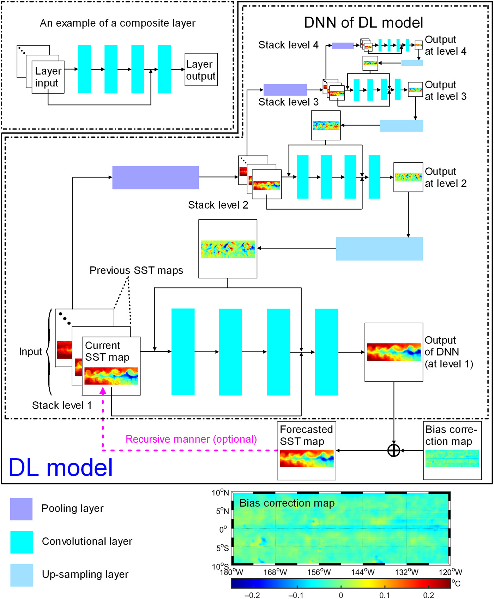

## 1.2 AI-GOMS

> - **论文引用：**W. Xiong *et al.*, “AI-GOMS: Large AI-Driven Global Ocean Modeling System.” arXiv, Aug. 10, 2023. doi: [10.48550/arXiv.2308.03152](https://doi.org/10.48550/arXiv.2308.03152).
> - **论文直看：**https://ar5iv.labs.arxiv.org/html/2308.03152

论文摘要：海洋建模是模拟海洋物理、化学和生物过程的有力工具，是海洋科学研究和实用海洋学的基础。现代海洋数值建模主要由调控方程和数值算法组成。非线性不稳定性、计算量大、重用效率低、耦合成本高等问题逐渐成为制约海洋数值建模进一步发展的主要瓶颈。近年来，基于人工智能的科学计算建模在数字孪生和科学模拟方面展现出了革命性的潜力，但海洋数值建模的瓶颈问题尚未得到进一步解决。在此，我们提出了一个大型人工智能驱动的全球海洋建模系统 AI-GOMS，用于精确高效的全球海洋日常预测。AI-GOMS 由一个骨干模型和轻量级微调模型组成，骨干模型采用基于傅立叶的屏蔽自动编码器结构，用于基本海洋变量预测；轻量级微调模型包含区域降尺度、波浪解码和生化耦合模块。AI-GOMS 以 1/4∘ 的空间分辨率对 15 个深度层的全球海洋基本变量进行了 30 天的预测，取得了最佳性能。除了在统计指标方面的良好表现外，AI-GOMS 还实现了 1/12∘ 空间分辨率的黑潮区域中尺度漩涡和热带太平洋海洋分层的模拟。AI-GOMS 为地球系统建模提供了一种新的骨干-下游模式，使该系统具有可转让性、可扩展性和可重复使用性。

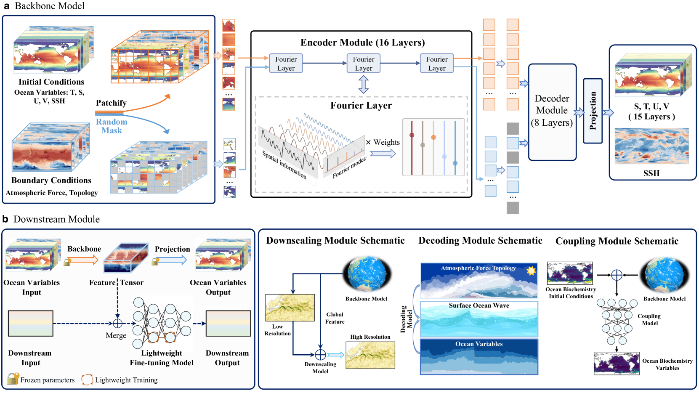

AI-GOMS（Large AI-Driven Global Ocean Modeling System）是一个先进的人工智能驱动的全球海洋建模系统，旨在为海洋日常预测提供准确和高效的方法。该系统由几个关键部分组成：

1. **背景模型**：AI-GOMS 的核心是一个基于傅里叶变换的掩码自编码器结构的背景模型，用于基本海洋变量的预测。

2. **微调模型**：此外，系统包括几个轻量级的微调模型，用于区域降尺度、波浪解码和生物化学耦合。

3. **优异的预测性能**：AI-GOMS 在全球海洋基本变量的30天预测中表现优异，能够处理15个深度层，空间分辨率达到1/4°。特别是在统计指标上，AI-GOMS 展现出了良好的性能。

4. **模拟中尺度涡旋和海洋分层**：AI-GOMS 能够在黑潮区域以 1/12° 的空间分辨率模拟中尺度涡旋，并能够模拟热带太平洋的海洋分层。

5. **系统架构**：AI-GOMS 提供了一种新的支柱-下游范式，使得模型系统具有可传递性、可扩展性和可重用性。

AI-GOMS 的开发显示了人工智能在科学计算中的革命性潜力，特别是在数字孪生和科学模拟领域。此外，AI-GOMS支持多种数据源，包括二维、三维和稀疏数据，但所有数据都需要预处理为网格状数据。

AI-GOMS 为海洋科学研究和操作性海洋学提供了一种强大的工具，可有效模拟海洋的物理、化学和生物过程，同时解决了传统数值海洋建模的一些主要瓶颈问题，如非线性不稳定性、计算成本高昂、可重用性低和耦合成本高昂。

## 1.3 OceanGPT

> - **论文引用**：Z. Bi *et al.*, “OceanGPT: A Large Language Model for Ocean Science Tasks.” arXiv, Oct. 25, 2023. doi: [10.48550/arXiv.2310.02031](https://doi.org/10.48550/arXiv.2310.02031).
> - **项目主页：**https://www.zjukg.org/project/OceanGPT
> - **模型下载：**https://huggingface.co/zjunlp/oceangpt-7b
> - **开源代码：**https://github.com/zjunlp/KnowLM

论文摘要：海洋是生命和生物多样性的宝库，研究海洋的海洋科学意义重大，因为海洋占地球表面的 70% 以上。最近，大型语言模型（LLMs）的进步改变了科学范式。尽管大型语言模型在其他领域取得了成功，但目前的大型语言模型往往无法满足海洋学家等领域专家的需求，而且大型语言模型在海洋科学方面的潜力也未得到充分挖掘。其内在原因可能是海洋数据的巨大和复杂性，以及对更高粒度和丰富知识的需求。为了缓解这些问题，我们引入了 OceanGPT，它是海洋领域有史以来第一个 LLM，是各种海洋科学任务的专家。我们提出了 DoInstruct，这是一个自动获取大量海洋领域指令数据的新型框架，它基于多代理协作生成指令。此外，我们还构建了首个海洋学基准--OceanBench，以评估 LLM 在海洋领域的能力。通过综合实验，OceanGPT 不仅在海洋科学任务方面展示了更高水平的知识专长，还在海洋技术方面获得了初步的体现智能能力。代码、数据和检查点即将在此 https://github.com/zjunlp/KnowLM 上提供。

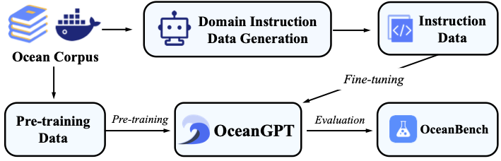

OceanGPT 是首个海洋 LLM，在各种海洋科学任务中表现出卓越的性能。它可以根据海洋学家的指示回答海洋学问题，展示了海洋学方面的专业知识。

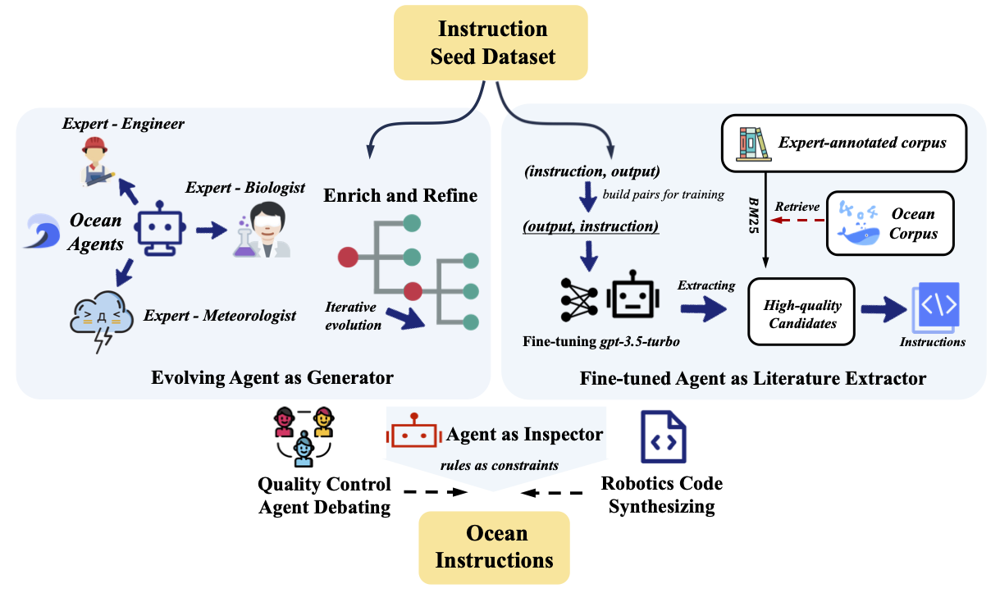

DoInstruct 是一个自动化领域指令演化框架，通过多机器人协作构建海洋指令数据集。我们的框架有效缓解了获取海洋领域数据的困难。为了有效地模拟和获取这些数据，DoInstruct 通过多代理协作获取海洋指令。每个代理都被视为特定领域（主题）的专家，负责生成相应的数据。

## 1.4 基于自注意力的神经网络在三维多变量建模中的应用及其对厄尔尼诺现象的有效预测

> - **中国科学院海洋研究所发布：**http://www.qdio.cas.cn/2019Ver/News/kyjz/202303/t20230323_6707600.html
>
> - **论文引用：**L. Zhou and R.-H. Zhang, “A self-attention–based neural network for three-dimensional multivariate modeling and its skillful ENSO predictions,” *Science Advances*, vol. 9, no. 10, p. eadf2827, Mar. 2023, doi: [10.1126/sciadv.adf2827](https://doi.org/10.1126/sciadv.adf2827).

近几年来，基于大数据的 AI 模型已成功应用于天气预报和气候预测等领域。这些数据驱动的神经网络模型在特定任务中的性能已达到甚至超越当前先进的动力模式，成为促进地球系统建模发展的重要工具。但目前多数神经网络模型是针对特定变量、特定任务来构建的，受限于算法与建模等难度，多数模型仅能对单点时间序列或单变量场进行预测 , 而对多变量三维场时空演变的长时间预测仍存在很大的挑战。

针对上述问题，研究团队基于改进型的 Transformer 模型，在充分考虑海气变量场间的强时间依赖性和空间非局地相关性等耦合特征的基础上，率先成功构建了由数据驱动的多变量 3D 场的海气耦合系统预测模型（简称为 3D-Geoformer），并将其成功应用于厄尔尼诺与南方涛动（ENSO）相关的 3D 上层海洋温度场及海表风应力场的跨年度预测试验。该模型克服了传统神经网络算法（如循环神经网络（RNN））中串行计算效率低和梯度易消失等劣势，通过特别设计的时空多头注意力机制模块，能有效提取格点序列时间依赖特征和多变量场空间非局地相关性，更合理表征了多变量数据的 3D 时空演变特征及其内在的动力学关系，最终成功实现了对热带太平洋海气多变量三维场的长时间准确预测（如 Nino3.4 区海温异常的有效预测时长超过 18 个月）；对 2015-2016 年超强厄尔尼诺事件的预测表明，该模型能合理表征 3D 温度场时空演变及与风场间的耦合。

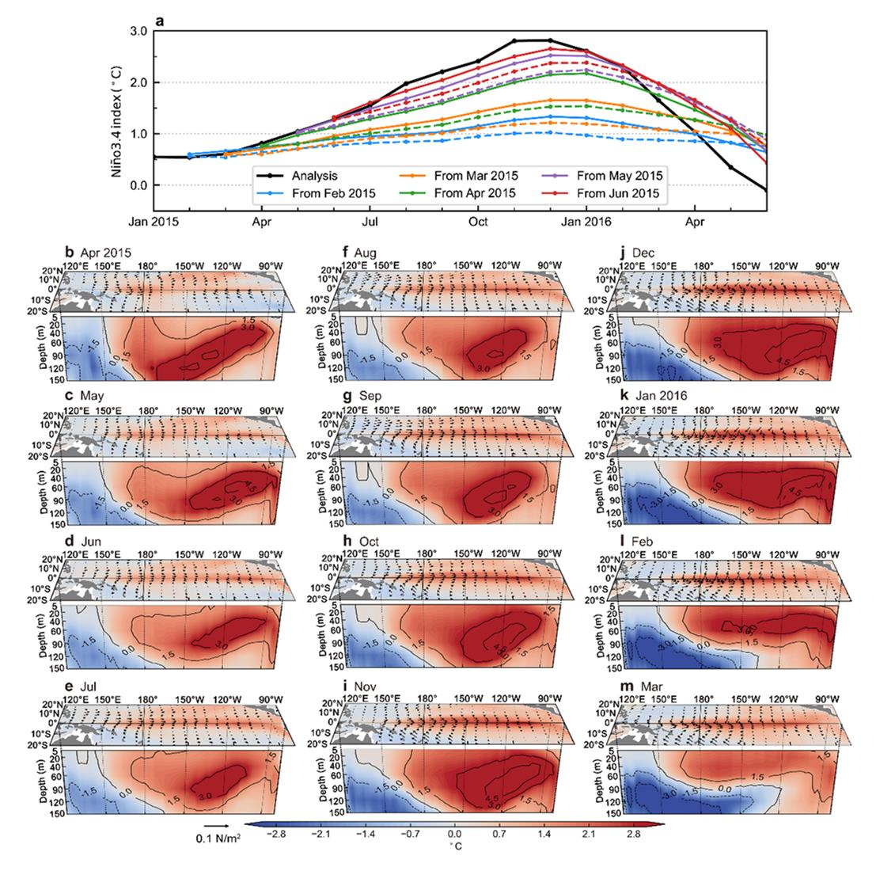

该研究创新性地将基于时空注意力机制的 Transformer 模型应用于 ENSO 预测和其海气耦合动力过程的表征，首次实现了从单一变量、单点（或区域平均）的时间序列预测到多变量、三维立体场时空预测的重要跨越，为 ENSO 预测提供了一个新的有效工具。另外，该 3D-Geoformer 模型良好的可拓展性允许其稍加修改即可方便地应用于更大区域、更多变量的预测任务，对促进人工智能技术在气候变化研究中的应用有重要意义。

## 1.5 琅琊泊

2022 年 9 月，在两位教授的大力支持下，中国海洋大学、华为、青岛人工智能计算中心三方达成合作共识，共同打造基于昇腾 AI 的 “琅琊泊” 海洋预报大模型。2022 年 12 月，“琅琊泊” 海洋预报大模型实现阶段性进展，顺利完成与全场景 AI 框架昇思 MindSpore 的兼容性测试，并有多项成果已经集成到国家海洋环境预报中心、国家气象局等单位的业务系统中

董军宇介绍，“琅琊泊” 的目标是可对全球任意区域做 2 小时内的强对流临近预报，打造全球首个强对流领域的 “ChatGPT”，助力青岛抢占全球海洋气象领域灾害预警制高点。据了解，“琅琊泊” 海洋环境预报大模型采用华为 “全场景 AI 计算框架 Mindspore”，依托青岛人工智能计算中心的澎湃算力，其海面风场和浪场实时订正模型，改变了以往数值订正思路，以大数据驱动方法另辟蹊径，通过多任务、双编码器、动态像素损失、时序滚动 - 空间滑动超采样等先进 AI 方法学训练深度学习订正模型。此外，“琅琊泊” 实现了将东西跨度 4600~6600 公里、南北跨度约 5000 公里的整个西北太平洋风场和浪场预报数据实时订正为再分析数据，大大提高了预报精确度，并有效解决了向量场（风向）和标量场（风速和浪高）同时订正的难题。

相关资料：

- 科学中国网：http://science.china.com.cn/2023-06/30/content_42428135.htm
- 中国计算机学会：https://www.ccf.org.cn/Focus/2023-10-25/796678.shtml
- 新闻稿：https://www.sohu.com/a/694117100_726570
- 中国工信新闻网：https://www.cnii.com.cn/rmydb/202307/t20230704_483993.html
- 华为计算发布：https://mp.weixin.qq.com/s/90jCEQ7AiqOAOemyf3aD8A

# 2. 舰船检测大模型

## 2.1 JointSAREO

> K. Cha, J. Seo, and T. Lee, “A Billion-scale Foundation Model for Remote Sensing Images.” arXiv, Apr. 11, 2023. doi: [10.48550/arXiv.2304.05215](https://doi.org/10.48550/arXiv.2304.05215).

摘要：由于基础模型在视觉任务中的潜力受到极大关注，在下游任务之前对这些模型进行预训练已成为一个关键步骤。预训练基础模型的三个关键因素是预训练方法、预训练数据集的大小和模型参数的数量。最近，遥感领域的研究主要集中在预训练方法和数据集的规模上，对模型参数数量的重视程度有限。本文针对这一不足，研究了增加模型参数数量对基础模型在旋转物体检测和语义分割等下游任务中的性能的影响。我们用不同数量的参数（包括 8600 万、60526 万、1300 万和 2400 万）对基础模型进行了预训练，以确定下游任务的性能是否会随着参数的增加而提高。据我们所知，这是遥感领域首个十亿尺度的地基模型。此外，我们还提出了在遥感领域扩大和微调视觉变换器的有效方法。为了评估下游任务的总体性能，我们使用 DOTA v2.0 和 DIOR-R 基准数据集进行旋转物体检测，并使用波茨坦和 LoveDA 数据集进行语义分割。实验结果表明，在所有基准数据集和下游任务中，随着参数数量的增加，基础模型的性能和数据效率都有所提高。此外，我们的模型在 DIOR-R、Postdam 和 LoveDA 等多个数据集上达到了最先进的性能。

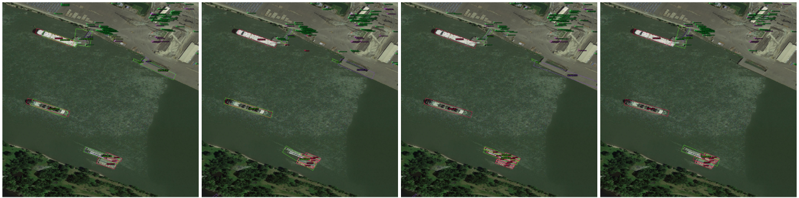

## 2.2 Scale-MAE

> R. Gupta, “Scale-MAE: A Scale-Aware Masked Autoencoder for Multiscale Geospatial Representation Learning”.
>
> 论文地址：https://www2.eecs.berkeley.edu/Pubs/TechRpts/2023/EECS-2023-263.html
>
> 论文PDF：http://www2.eecs.berkeley.edu/Pubs/TechRpts/2023/EECS-2023-263.pdf

摘要：大型预训练模型通常与大量增强的图像进行联网，以模拟不同的条件和尺度。对于遥感等与尺度相关的领域，此类模型忽略了数据中的尺度特定信息。在本文中，我们介绍了 Scale-MAE，这是一种在整个预训练过程中明确学习不同已知尺度数据之间关系的预训练方法。Scale-MAE 通过屏蔽已知输入比例的输入图像对网络进行预训练，图像覆盖的地球面积决定了 ViT 位置编码的比例，而不是图像的分辨率。Scale-MAE 使用标准 ViT 主干网对遮蔽图像进行编码，然后通过带通滤波器对遮蔽图像进行解码，以重建较低/较高比例的低/高频率图像。我们发现，让网络同时负责重建低频/高频图像，可以为遥感图像提供强大的多尺度表示。与目前最先进的技术相比，Scale-MAE 在八个遥感数据集上实现了平均 2.4 5.6% 的非参数 kNN 分类改进，并在 SpaceNet 建筑分割传输任务中，在一系列评估尺度上实现了 0.9 mIoU 至 1.7 mIoU 的改进。

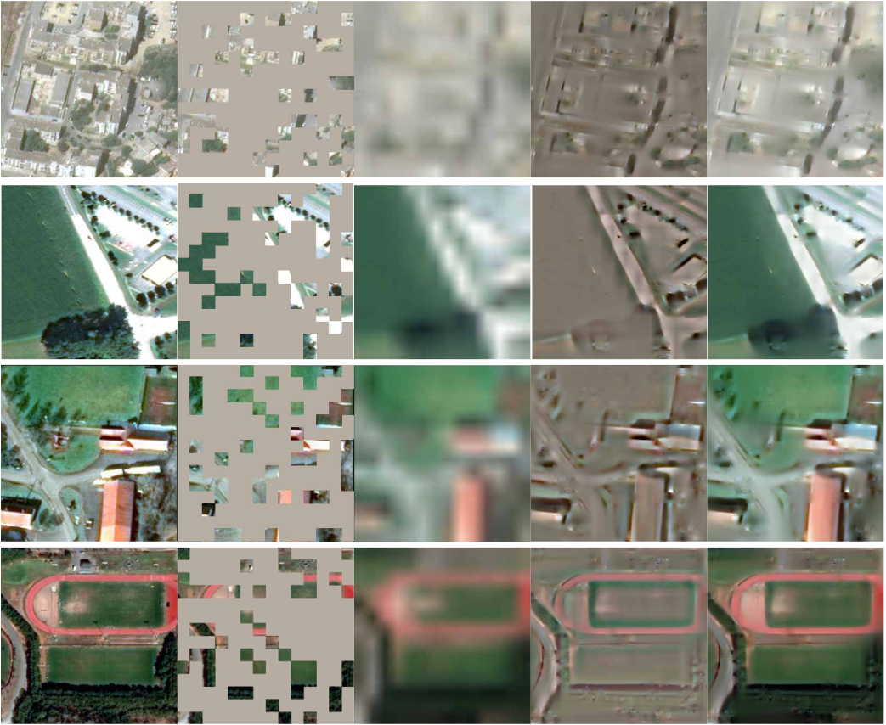

## 2.3 RSP（有监督单模态预训练遥感大模型）

> D. Wang, J. Zhang, B. Du, G.-S. Xia, and D. Tao, “An Empirical Study of Remote Sensing Pretraining,” *IEEE Transactions on Geoscience and Remote Sensing*, vol. 61, pp. 1–20, 2023, doi: [10.1109/TGRS.2022.3176603](https://doi.org/10.1109/TGRS.2022.3176603).
>
> 开源代码：https://github.com/ViTAE-Transformer/ViTAE-Transformer-Remote-Sensing
>
> 知乎转载：https://zhuanlan.zhihu.com/p/513975738

京东探索研究院联合武汉大学、悉尼大学借助迄今为止最大的遥感场景标注数据集 MillionAID，从头开始训练包括卷积神经网络（CNN）和已经在自然图像计算机视觉任务中表现出了良好性能的视觉 Transformer（Vision Transformer）网络，首次获得了一系列基于监督学习的遥感预训练基础骨干模型。并进一步研究了 ImageNet 预训练（IMP）和遥感预训练（RSP）对包括语义分割、目标检测在内的一系列下游任务的影响。

实验结果证实了探索研究院先前提出的先进 Vision Transformer 系列模型 ViTAE 在遥感任务上的优越性，并发现 RSP 在遥感任务上的有效性以及感知相关语义方面具有的独特性。实验结果进一步表明 RSP 会受到上下游任务差异的影响，这些发现对遥感大规模数据集和预训练方法提出了新的要求。

论文摘要：深度学习在很大程度上重塑了遥感（RS）研究对航空图像的理解，并取得了巨大成功。然而，由于自然图像与航空图像相比不可避免地存在较大的领域差距，因此现有的大多数深度模型都是以 ImageNet 预训练权重进行初始化的，这可能会限制其在下游航空场景任务中的微调性能。这一问题促使我们对航空图像上的 RS 预训练（RSP）进行实证研究。为此，我们借助迄今为止最大的 RS 场景识别数据集--MillionAID--从头开始训练不同的网络，获得了一系列 RS 预训练骨干，包括卷积神经网络（CNN）和视觉变换器（如 Swin 和 ViTAE），这些网络在计算机视觉任务中表现出了良好的性能。然后，我们研究了 RSP 对代表性下游任务的影响，包括使用这些 CNN 和视觉变换器骨干进行场景识别、语义分割、物体检测和变化检测。实证研究表明，RSP 有助于在场景识别任务和感知 RS 相关语义（如 "桥 "和 "飞机"）时提供与众不同的性能。我们还发现，尽管 RSP 可以减轻传统 ImageNet 对 RS
图像进行预训练时的数据差异，但它仍可能受到任务差异的影响，即下游任务需要与场景识别任务不同的表示。这些发现要求进一步研究大规模预训练数据集和有效的预训练方法。代码和预训练模型将在 https://github.com/ViTAE-Transformer/ViTAE-Transformer-Remote-Sensing 上发布。

**在论文的“Aerial Object Detection”小节中提到：**

由于航空图像是在空中自上而下拍摄的，因此物体可以呈现在鸟瞰图的任何方向。因此，航空物体检测是定向边界框（OBB）检测，有别于自然图像上通常的水平边界框（HBB）任务[111], [117], [134]。在本文中，与分割类似，我们也在实验中使用了不同的检测数据集。具体来说，我们分别评估了多类别 RS 物体检测和**单类别船舶检测子任务**。

数据集：为了实现上述目标，我们分别使用了两个数据集，包括大规模 DOTA 场景[135] 和常用的 HRSC2016 数据集[136]。

1) DOTA：这是最著名的大规模 OBB 检测数据集。它共包含 2806 幅图像，大小从 800 × 800 到 4000 × 4000 不等，其中 188 282 个实例属于 15 个类别。训练集、验证集和测试集分别包含 1411/458/937 块瓷砖。值得注意的是，由于 iSAID 数据集和训练集共享相同的场景集，因此其类别与 iSAID 数据集完全相同。不同之处在于不同任务的注释。
2) HRSC2016： 这是一个**专门的船舶检测数据集**，其中的边界框以任意方向标注。该数据集包含 1061 幅图像，尺寸从 300 × 300 到 1500 × 900 不等。在正式划分中，436/181/444 幅图像分别用于训练、验证和测试。由于不需要识别**船舶**类型，因此数据集只有一个类别。

实现细节和实验设置：与分割类似，ResNet 模型采用 SGDM 算法训练，学习率为 0.005，动量为 0.9，权重衰减为 0.0001；视觉 Transformer 采用 AdamW 优化器训练，学习率和权重衰减分别设置为 0.0001 和 0.05。这些模型在 DOTA 和 HRSC2016 场景上分别进行了 12 次和 36 次训练，批量大小为 2。学习率由多步调度器调整。在 DOTA 数据集上，学习率将在第 8 次和第 11 次之后分别降低 10 倍，而在 HRSC2016 场景上，相应的设置是第 24 次和第 33 次。我们使用 SOTA OBB 检测框架之一--ORCN [126]--来评估不同预训练骨干的性能。我们采用 ORCN 的默认超参数，该参数在 OBBDetection 中实现。2 按照 [126]，DOTA 数据集被采样并裁剪为 1024 × 1024 补丁，间距为 824，而 HRSC2016 图像被缩放以保持长宽比，短边等于 800，长边的长度小于或等于 1333。训练期间的数据增强包括随机水平翻转和垂直翻转。为方便起见，原始训练集和验证集合并用于训练，而 DOTA 和 HRSC2016 的原始测试集则分别用于评估。我们报告了所有类别的平均精度（mAP）和每个类别在相应测试集上的平均精度（AP）。所有模型均在单个 V100 GPU 上进行训练。

算法比较：与 IMP-ViTAEv2-S 相比，RSP-ViTAEv2-S 所获得的大多数类别的 APs 都较小，这意味着 IMP 具有普适性。尽管如此，RSP-ViTAEv2-S 的 mAP 还是高于 IMP-ViTAEv2-S，因为 RSP 在 "桥梁 "和包括 "直升机 "或 "飞机 "在内的航空器类别中具有显著优势，这与之前的分割实验结果相呼应，而在其他类别中，这两个模型之间的差距并不大。综合以上两点，RSP-ViTAEv2-S 的整体性能优于 IMP-ViTAEv2-S。在 HRSC2016 数据集上，表现最好的 CHPDet [133]是考虑到船舶特性而专门设计的检测器。对于 ORCN 相关网络[126]，RSP 和 IMP 的结果大致相同，双方各有胜负。与 CNN 相比，视觉变换器模型并未体现出优势。我们认为，在这个相对简单的子任务中，只需要检测一个类别，而 HRSC2016 中的船只尺寸相对比 DOTA 大，性能可能已经饱和。

## 2.4 RemoteCLIP（视觉-文本联合多模态预训练遥感大模型）

> F. Liu, D. Chen, Z. Guan, X. Zhou, J. Zhu, and J. Zhou, “RemoteCLIP: A Vision Language Foundation Model for Remote Sensing.” arXiv, Aug. 09, 2023. doi: [10.48550/arXiv.2306.11029](https://doi.org/10.48550/arXiv.2306.11029).
>
> 开源项目：https://github.com/ChenDelong1999/RemoteCLIP

论文摘要：通用基础模型在人工智能领域越来越重要。虽然自监督学习（SSL）和遮蔽图像建模（MIM）在为遥感建立此类基础模型方面取得了可喜的成果，但这些模型主要学习低级特征，需要注释数据进行微调，而且由于缺乏语言理解能力，不适用于检索和零镜头应用。针对这些局限性，我们提出了 RemoteCLIP，它是第一个用于遥感的视觉语言基础模型，旨在学习具有丰富语义的强大视觉特征，以及对齐的文本嵌入，以实现无缝的下游应用。为了解决预训练数据稀缺的问题，我们利用数据缩放技术，在方框到字幕（B2C）和遮罩到方框（M2B）转换的基础上对异构注释进行转换，并进一步结合无人机图像，从而产生了一个扩大 12 倍的预训练数据集。RemoteCLIP 可应用于各种下游任务，包括零镜头图像分类、线性探测、k-NN 分类、少镜头分类、图像文本检索和对象计数。在 16 个数据集（包括新引入的用于测试物体计数能力的 RemoteCount 基准）上进行的评估表明，在不同的模型规模下，RemoteCLIP 始终优于基线基础模型。令人印象深刻的是，RemoteCLIP 在 RSICD 数据集上的平均召回率为 9.14%，在 RSICD 数据集上的平均召回率为 8.92%，超过了之前的 SoTA。在零镜头分类方面，我们的 RemoteCLIP 在 12 个下游数据集上的平均准确率比 CLIP 基线高出
6.39%。预训练模型可在 https://github.com/ChenDelong1999/RemoteCLIP 上获取。

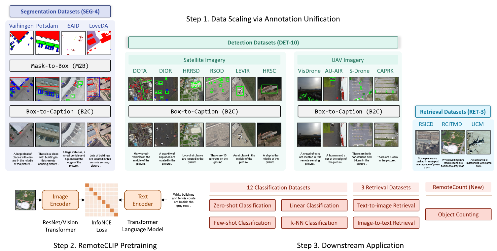

RemoteCount 数据集样本的可视化。感兴趣的对象用红色边界框标注：

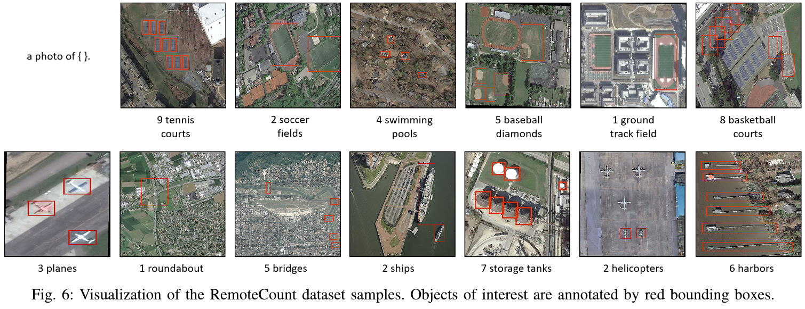

## 2.5 RSGPT（视觉-文本联合多模态预训练遥感大模型）

> Y. Hu, J. Yuan, C. Wen, X. Lu, and X. Li, “RSGPT: A Remote Sensing Vision Language Model and Benchmark.” arXiv, Jul. 27, 2023. doi: [10.48550/arXiv.2307.15266](https://doi.org/10.48550/arXiv.2307.15266).

论文摘要：以 GPT-4 为代表的大规模大型语言模型的出现，极大地推动了人工通用智能的快速发展，并引发了人工智能 2.0 的革命。在遥感（RS）领域，人们对开发专门用于该领域数据分析的大型视觉语言模型（VLM）的兴趣与日俱增。然而，目前的研究主要围绕视觉识别任务展开，缺乏全面、大规模的图像-文本数据集，这些数据集既不一致，也不适合训练大型视觉语言模型，这给有效训练此类模型用于遥感应用带来了巨大挑战。在计算机视觉领域，最近的研究表明，在小规模、高质量的数据集上对大型视觉语言模型进行微调，可以在视觉和语言理解方面产生令人印象深刻的性能。这些结果可与在海量数据（如 GPT-4）上从头开始训练的最先进的 VLM 相媲美。受这一迷人想法的启发，我们在这项工作中建立了一个高质量的遥感图像标题数据集（RSICap），它有助于在遥感领域开发大型 VLM。以往的遥感数据集要么采用模型生成的标题，要么采用简短的描述，而 RSICap 则不同，它包含 2,585 个由人类标注的标题，信息丰富且质量高。该数据集为每幅图像提供了详细的描述，包括场景描述（如住宅区、机场或农田）以及物体信息（如颜色、形状、数量、绝对位置等）。为了便于在 RS 领域对 VLM 进行评估，我们还提供了一个名为 RSIEval
的基准评估数据集。该数据集由人工标注的字幕和视觉问答对组成，可在 RS 的背景下对 VLM 进行全面评估。

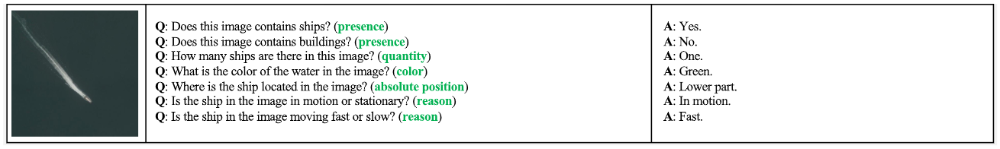

## 2.6 “天权” 遥感大模型

“天权” 遥感大模型是一款基于多模态大模型技术的遥感解译专用 AI 大模型，它面向遥感测绘影像多载荷多分辨率大尺度的专业特点，结合 CV 大模型和 NLP 技术，融合航天宏图 PIE-Engine 时空云服务核心技术，赋能遥感影像智能解译。

- **技术更新，泛化能力强：**“天权” 遥感大模型立足开源大模型基础结构，面向遥感数据进行定制化研发，融合 PIE-Engine AI 43 类语义分割及变化检测模型，适配 10 余类重点目标检测识别业务，适用于 SAR、光学、多光谱卫星、无人机航拍等多模态时空数据，感知能力覆盖水体、植被、道路、机场、港口、飞机、**船只**等。

- **能力更新，助力产品升级：**通过集成部署 “天权” 大模型，可推动现有样本标注平台智能预标注插件更新；构建 “问答式检测” 产品，提供交互式智能解译体验，赋能影像智能检索、地物智能提取采编；融入数字孪生体系，提供大模型驱动的目标检测和内容生成能力。

- **场景更新，应用覆盖广泛：**结合 PIE-Engine 软件体系，通过 AI 技术赋能，面向自然资源、农业水利、应急管理、国土资源、国防安全，探索 “大模型训练 + 小模型部署” 落地应用，全方位解锁空间信息，实现遥感应用模式创新。

相关链接：

- 航天宏图公众号：https://mp.weixin.qq.com/s/aeVVJswNxQ5HYURoal0PFQ

## 2.7 Remote-Sensing-RVSA

> - 开源项目：https://github.com/ViTAE-Transformer/Remote-Sensing-RVSA
> - 论文：https://ieeexplore.ieee.org/document/9956816
> - 论文标题：Advancing Plain Vision Transformer Towards Remote Sensing Foundation Model《将朴素视觉转换器推向遥感基础模型》
> - 武汉大学人工智能研究院发布：http://ai.whu.edu.cn/index.php?a=show&catid=4&id=86

团队针对具有 1 亿参数的一般结构的 ViT (Plain ViT)，采用掩码图像建模算法在大规模遥感数据集上进行无监督预训练获得初始权重，接着通过引入不同的学习因子在键特征和值特征上获得可以同时进行缩放平移旋转变换的窗口，进而设计出符合遥感图像特点的旋转可变窗口注意力机制来代替 Transformer 中的原始完全注意力。新的注意力可以从生成的不同窗口中提取丰富的上下文信息来学习更好的目标表征，并显著降低计算成本和内存占用，能够有效应对遥感图像具有的大尺寸特性和遥感目标的朝向任意性。在多种遥感任务上的微调实验表明模型在精度、效率、可解释性等方面具有明显优势。

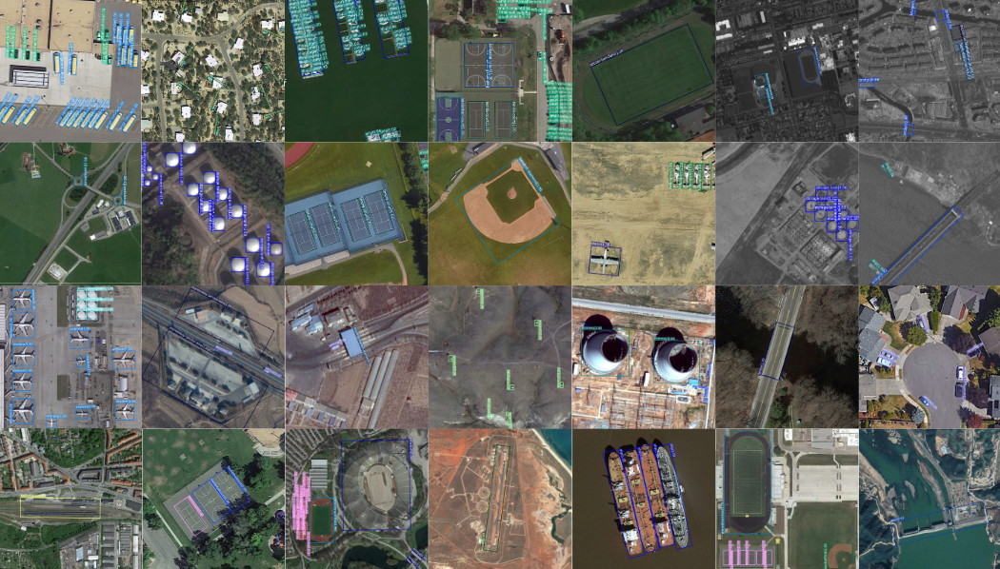

一些视觉检测结果。前两行是 ViTAE-B + RVSA 在 DOTA-V1.0 上的检测结果，其余各行是 ViTAE-B + RVSA 在 DIOR-R 上的检测结果。

团队介绍：智能感知与机器学习研究组 SIGMA (Sensing IntelliGence and MAchine learning group) 是一个依托武汉大学计算机学院、人工智能研究院、测绘遥感信息工程国家重点实验室的跨学科交叉研究团队，课题组主要研究人工智能、机器学习、计算机视觉等领域的理论与技术，实现自然图像、医学图像和遥感图像的高效、高精度和智能化解译。

# 3. 相关技术

## 3.1 用于多源星载合成孔径雷达图像船舶探测的特定领域知识提取 Transformer 方法

> S. Zhao, Y. Luo, T. Zhang, W. Guo, and Z. Zhang, “A domain specific knowledge extraction transformer method for multisource satellite-borne SAR images ship detection,” *ISPRS Journal of Photogrammetry and Remote Sensing*, vol. 198, pp. 16–29, Apr. 2023, doi: [10.1016/j.isprsjprs.2023.02.011](https://doi.org/10.1016/j.isprsjprs.2023.02.011).

摘要：多源星载合成孔径雷达（SAR）图像具有不同的概率分布。因此，传统的监督学习无法在一个新的星载合成孔径雷达数据集上实现良好的测试性能，同时在另一个现有的星载合成孔径雷达数据集上训练出一个良好的模型。本文提出了一种域自适应（DA）Transformer 物体检测方法来解决无标记多源星载合成孔径雷达图像物体检测问题。与现有的基于卷积神经网络（CNN）的 DA 方法更侧重于多级局部特征提取不同，我们选择使用 Vision Transformer（ViT）更快区域 CNN（FRCNN）作为基线网络来应对 SAR 图像的全局特征提取。然后，利用两个分类标记来学习不同域的映射，充分提取特定域知识，生成两个不同的特征空间，分别依靠原始标签和伪标签来训练源域和目标域特征空间。此外，还通过特征聚类对目标域的伪标签进行提炼和重构，以提高目标域知识的准确性。最后，利用 FRCNN 的原始检测头检测目标域 SAR 图像对象。在高分三号、TerraSAR-X、哨兵一号和雷达卫星二号等多源星载合成孔径雷达图像数据集上的大量实验表明，与其他最先进的方法（SOTA）相比，本文提出的方法能达到最高的目标检测精度。特别是以最近提出的基于 Transformer 的方法为例，我们的方法在精度上提高了 5%以上，在训练时间上减少了 16% 以上。

## 3.2 S-DETR

> Z. Xing, J. Ren, X. Fan, and Y. Zhang, “S-DETR: A Transformer Model for Real-Time Detection of Marine Ships,” *Journal of Marine Science and Engineering*, vol. 11, no. 4, Art. no. 4, Apr. 2023, doi: [10.3390/jmse11040696](https://doi.org/10.3390/jmse11040696).

摘要：由于船舶的形状和尺度不断变化，加上复杂的海洋背景，在考虑实时性要求的同时准确探测海上多尺度船舶仍然是一项挑战。为解决这一问题，我们在 DETR 框架的基础上提出了一种名为 S-DETR 的模型，用于端到端检测海面上的船只。我们设计了一个尺度关注模块，利用全局平均池带来的全局信息，有效地学习不同尺度信息的权重。我们分析了端到端检测器性能下降的潜在原因，并提出了一种基于密集查询的解码器。虽然整个 S-DETR 模型的计算复杂度和收敛性还没有得到严格的数学证明，但 Dense Query 可以将多头自关注的计算复杂度从 O(N2 q ) 降低到 O(Nq)。为了评估 S-DETR 的性能，我们在新加坡海事数据集和海洋图像数据集上进行了实验。实验结果表明，所提出的方法能有效解决复杂海洋环境中的多尺度船舶检测问题，并达到了最先进的性能。S-DETR 的模型推理速度与单级目标检测模型相当，能满足岸边船舶检测的实时性要求。

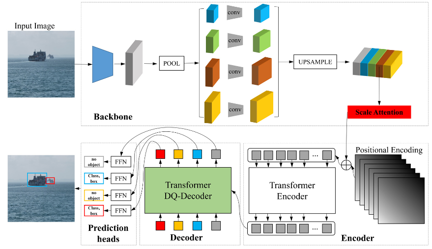

DETR 模型的一些固有缺陷使其无法直接应用于船舶检测领域，如对小型目标的检测性能较差。根据船舶检测场景的特点，本文提出了一种船舶检测模型（S-DETR）的设计方案。其主要贡献如下：

1. 首次设计了基于海岸图像的船舶探测变压器模型。利用变换器结构的全局建模能力，该模型在公共数据集新加坡海事数据集上取得了最佳性能。所提出的 S-DETR 模型可作为研究基于变换器的船舶检测方法的基准模型。
2. 在主干网络中设计了一个融合多尺度信息的尺度关注模块，这比过去简单地使用卷积来融合不同尺度的分支信息要好。在船舶尺度变化较大的场景中，检测性能可以得到改善。
3. 我们为 DETR 提出了一种新的解码器，即 DQ 解码器，它大大提高了 DETR 在人群船舶检测方面的性能。DQ 模块可以在不增加计算复杂度的情况下大大提高密集船只场景中的检测性能。该解码器可作为即插即用模块，用于其他密集型检测任务。

## 3.3 CRTransSar

> R. Xia *et al.*, “CRTransSar: A Visual Transformer Based on Contextual Joint Representation Learning for SAR Ship Detection,” *Remote Sensing*, vol. 14, no. 6, Art. no. 6, Jan. 2022, doi: [10.3390/rs14061488](https://doi.org/10.3390/rs14061488).

摘要：合成孔径雷达（SAR）图像目标检测广泛应用于军事、民用等领域。然而，由于合成孔径雷达图像目标散射强、边缘轮廓信息不清晰、尺度多、稀疏性强、背景干扰大等特点的限制，现有的检测方法精度较低。对此，针对 SAR 目标检测任务，本文结合变换器的全局上下文信息感知能力和卷积神经网络（CNN）的局部特征表示能力，创新性地提出了基于上下文联合表示学习的视觉变换器框架，简称 CRTransSar。首先，本文介绍了最新的 Swin Transformer 作为基本架构。其次，本文介绍了 CNN 的局部信息捕捉，并提出了基于上下文联合表征学习的骨干网（称为 CRbackbone）的设计，以提取更丰富的上下文特征信息，同时强化 SAR 目标特征属性。此外，还介绍了一种新的跨分辨率注意力增强颈（称为 CAENeck）的设计，以增强多尺度合成孔径雷达目标的可表征性。我们的方法在 SSDD 数据集上的 mAP 准确率达到了 97.0%，达到了最先进的水平。此外，基于我们研究小组参与开发并已发射入轨的 HISEA-1 商业合成孔径雷达卫星，我们发布了名为 SMCDD 的更大规模合成孔径雷达多类目标检测数据集，验证了我们方法的有效性。

本文结合 Transformer 的全局上下文信息感知能力和面向 SAR 目标检测任务的 CNN 的局部信息特征提取能力，创新性地提出了基于上下文的联合视觉 Transformer 表征学习框架，简称 CRTransSar。这是 SAR 目标检测领域的首次框架尝试。来自 SSDD 和自建 SAR 目标数据集的实验结果表明，我们的方法实现了更高的精度。本文的重点是目标检测框架的 Backbone 和 Neck 的优化设计。因此，我们将级联掩码 r-cnn 框架作为我们方法的基本框架，我们的方法可以作为一个功能模块灵活地嵌入到任何其他目标检测框架中。本文的主要贡献如下：

1. 针对现有基于 CNN 的 SAR 目标检测方法缺乏全局远程建模和感知能力的问题，我们设计了以视觉 Transformer 为骨干的端到端 SAR 目标检测器。
2. 我们融入了多维混合卷积和自注意等策略，构建了基于上下文联合表征学习的新型视觉变换器骨干，称为 CRbackbone，以提高多尺度 SAR 目标的上下文突出特征描述能力。
3. 为了更好地适应多尺度变化和复杂背景干扰，我们构建了一个新的跨分辨率注意力增强颈（称为 CAENeck），它可以在计算复杂度增加不大的情况下指导动态注意力模块的多分辨率学习。
4. 我们还构建了大规模多类合成孔径雷达目标检测基准数据集。源数据主要来自我们课题组研制的中国第一颗商业遥感合成孔径雷达卫星HISEA-1

图 1：CRTransSar 网络的整体架构。

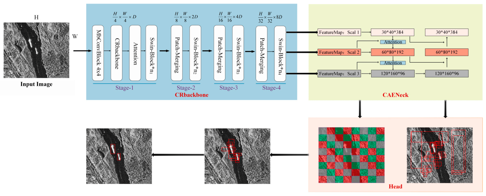

图 2：Swin Transformer 的整体结构。(a) Swin Transformer 结构图。(b) Swin Transformer 模块。

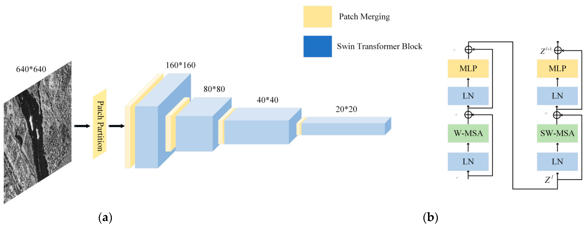

# 4. 数据集

## 4.1 百万级遥感场景识别数据集 MillionAID

> 官网：https://jin-pu.github.io/Million-AID/
>
> Hugging Face 数据集下载：https://huggingface.co/datasets/jonathan-roberts1/Million-AID

Million-AID 是一个包含百万实例的用于遥感场景分类的大型基准数据集。其包含了广泛的语义类别，即 51 个场景类别，由三级树的分级类别网络组织而成：51 个叶节点分为第二层的 28 个父节点，父节点又分组为第一级的 8 个节点，分别代表农业用地、商业用地、工业用地、公共服务用地、居住用地、交通用地、未利用地和水域 8 个底层场景类别。场景类别网络为数据集提供了良好的不同场景类别之间的关系组织和可扩展性。每个场景类别的图像数量大约在 2000 到 45000 之间，这使得数据集具有长尾分布的特性。此外，Million-AID 具有空间分辨率高、规模大、分布全球等优势，优于现有的场景分类数据集。

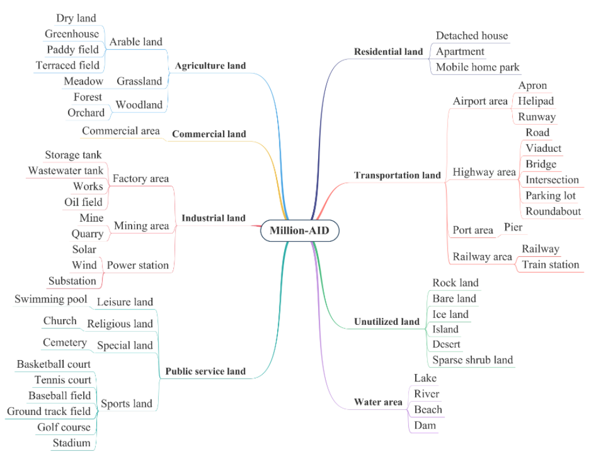

# 5. 相关论坛/资讯

## 5.1 CNCC2023 技术论坛

论坛信息：

- 主题：AI + 海洋：海洋大模型何时到来？
- 举办时间：10 月 26 日
- 主办方：CCF
- 承办方：CCF YOCSEF 青岛学术委员会、中国海洋学会人工智能海洋学专委会
- 论坛链接：https://www.ccf.org.cn/YOCSEF/Branches/Qingdao/News/2023-11-03/796826.shtml

## 5.2 智慧海洋大模型研讨会

研讨会信息：

- 内容：智慧海洋领域发展方向、大连海洋大数据资源情况、智慧海洋领域大模型产品和业务需求、关于建立海洋大模型打造大连智慧海洋优势等方面
- 举办时间：2023 年 9 月 20 日
- 主办方：大连理工大学人工智能大连研究院、大连市人工智能产业协会、大连市人工智能重点实验室联合主办
- 主持人：大连理工大学人工智能大连研究院江贺院长
- 参与嘉宾：大连海事大学人工智能学院、大连海洋大学信息工程学院、国家海洋环境监测中心、中国船舶集团有限公司第七六〇研究所、大连人工智能计算中心、华为技术有限公司、大连口岸物流网股份有限公司、遨海科技有限公司、大连海大智龙科技有限公司、中国移动通信集团辽宁有限公司大连分公司等企事业科研机构专家
- 相关链接
    - 大连市人民政府发布：https://www.dl.gov.cn/art/2023/9/26/art_2548_2197429.html
    - 大连市人工智能产业协会发布：https://mp.weixin.qq.com/s/pVxPqW3Pd4S3p1VDWC-Skg

