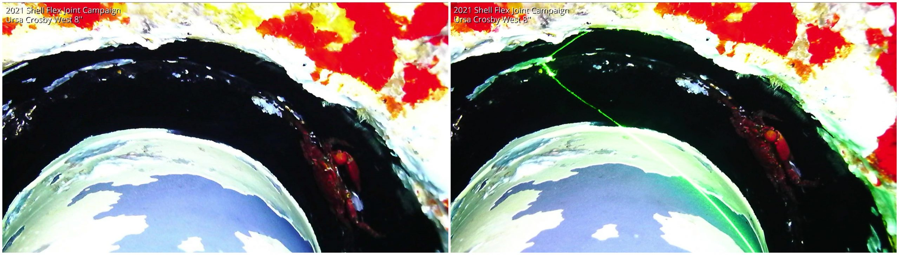

[TOC]

---

# 1. 概述

## 1.1 研究背景与目的

水下机器人是一种能够在水下环境中执行任务的自主或遥控机器人。它们通常被用于海洋科学、海洋资源勘探、海底地质调查、水下考古、水下搜救、水下作业等领域。水下机器人的研究和开发涉及到多个学科领域，包括机械工程、电子工程、计算机科学、水声学、海洋学等。软件在水下机器人中的作用主要体现在导航与定位系统、数据采集与处理、通信系统、自主决策/遥控控制、能源管理、环境感知与图像处理等方面。

## 1.2 研究范围

本报告主要研究软件在水下机器人中的应用，包括导航与定位系统、数据采集与处理、通信系统、自主决策/遥控控制、能源管理、环境感知与图像处理等方面。通过案例研究，分析国内外研究团队在水下机器人软件开发方面的最新进展，总结其技术特点和应用场景，为相关研究提供参考。

## 1.3 报告结构说明

本报告主要以案例为主，分析水下机器人软件在导航与定位系统、数据采集与处理、通信系统、自主决策/遥控控制、能源管理、环境感知与图像处理等方面的应用。每个案例包括研究背景、技术特点、应用场景等内容。最后，总结国内外研究团队在水下机器人软件开发方面的最新进展，展望未来的发展趋势。

# 2. 技术背景

## 2.1 水下机器人的主要功能与应用

水下机器人是一种能够在水下环境中执行任务的自主或遥控机器人。它们通常被用于海洋科学、海洋资源勘探、海底地质调查、水下考古、水下搜救、水下作业等领域。水下机器人的主要功能包括：

- 导航与定位系统：涉及机器人在水下环境中的定位、路径规划、避障以及目标跟踪等功能。这些系统通常依赖于声纳、惯性测量单元(IMU)
  、GPS（水面上）和其他传感器的数据。
- 数据采集与处理：包括水下影像采集、声纳数据处理、温度和化学成分的测量。软件在这一领域的开发旨在优化数据的收集、传输和处理流程，提高数据质量和分析效率。
- 通信系统：由于水下环境对电磁波的限制，水下机器人的通信系统多依赖于声学通信。软件开发需要解决数据传输速率低、延迟大、信号易受干扰等问题。
- 自主决策/遥控控制：涉及机器人自主决策/遥控控制的能力，自主决策包括基于环境感知进行自主避障、目标识别和任务执行等，通常集成了机器学习和人工智能算法。而遥控控制则是指人类操作员通过遥控器或者其他设备对机器人进行控制。
- 能源管理：旨在优化机器人的能源消耗，延长其在水下的作业时间。这包括电池管理、能源效率优化和能源回收技术等。
- 环境感知与图像处理：涉及图像识别、3D重建和环境映射等功能，以提高机器人对周围环境的感知和理解能力。
- 其他功能：如水下机器人的操控系统、机械臂、采样系统等。

## 2.2 软件在水下机器人中的作用

软件在水下机器人中起着至关重要的作用，它是机器人的大脑，负责控制机器人的运动、感知周围环境、执行任务等。软件在水下机器人中的主要作用包括：

- 控制系统：负责控制机器人的运动、姿态和操作，保证机器人能够按照预定的路径和速度进行移动和执行任务。
- 感知系统：负责感知周围环境，包括水下地形、水质、目标物体等信息，以便机器人能够准确地定位、避障和执行任务。
- 通信系统：负责机器人与地面控制中心或其他机器人之间的通信，传输控制指令、传感器数据和图像信息。
- 数据处理系统：负责处理传感器采集的数据，包括声纳数据、图像数据、水质数据等，提取有用信息并进行分析。
- 决策系统：负责根据感知系统采集的数据和任务要求，制定机器人的行动计划，包括路径规划、目标识别和任务执行等。
- 能源管理系统：负责管理机器人的能源消耗，优化电池使用、能源回收和节能措施，延长机器人在水下的作业时间。
- 图像处理系统：负责对采集的图像数据进行处理，包括图像识别、目标跟踪、三维重建等功能，提高机器人对周围环境的感知和理解能力。

# 3. 案例研究

## 3.1 导航与定位系统

> 涉及到机器人在水下环境中的定位、路径规划、避障以及目标跟踪等功能。这些系统通常依赖于声纳、惯性测量单元(IMU)
> 、GPS（水面上）和其他传感器的数据。
>
> 1. https://bzxb.cqut.edu.cn/html/202203/2096-2304(2022)03-0022-08.html

| **定位方式**                            | **简介**                                                               | **适用范围**     | **隐蔽性** | **干扰因素**                               | **待研究方向**                                   |
|-------------------------------------|----------------------------------------------------------------------|--------------|---------|----------------------------------------|---------------------------------------------|
| 惯性/航位推算导航                           | 利用惯性器件获得潜器速 度信息,然后对时间积分 得到潜器当前位置                                     | 全海域          | 好       | 随时间累积,误差不断 增大                          | 研制更高精度的惯性 器件,研究更多的辅助 导航技术来修正误差              |
| 水声学导航（LBL、SBL、USBL）                 | 利用声波信号的传输时间及其相位差来确定水下潜器的位置,精确度要高于惯性导航系统                              | 受限于声标基阵的作用范围 | 不好      | 系统误差、声速误差、反射路径误差、噪声误差、测量误差             | 降低各误差来源对导航精度的影响                             |
| SINS/SONAR 组合导航方式                   | 在利用惯导系统确定潜器的任务范围,结合水声学 导航修正误差并在基阵作 用范围内进行导航                          | 全海域          | 不好      | 系统误差、声速误差、 反射路径误差、噪声误 差、测量误差           | 降低各误差来源对导 航精度的影响                            |
| SINS/SONAR/GNSS 组合导航方式              | 在SINS/SONAR组合导航 方式的基础上利用 GNSS对声标基阵进行精确定位,同时结合水声通信技术将水下信息与水上指挥 中心进行互通 | 全海域          | 不好      | GNSS无方向分辨能力,易受地方信号干 扰;水声通信的传播速率与距离成反比  | 提高卫星导航系统的 抗干扰能力;同时提高 水声通信的传播速率与距离           |
| 结合地球物理的组合导航方式（地形匹配导航、重力匹配导航、地磁匹配导航） | 由惯性系统限定工作范围, 然后利用数据匹配算法将地球物理测量数据与先验 数据库进行匹配,从而获得水下潜器的实时位置            | 全海域          | 好       | 地球物理数据测量器件的精度;数据匹配算 法的精度和效率;地球物理数据库的规模 | 研制更高精度的测量器件;设计更高效率的数据匹配算法;获得精确、大量的地球物理数据库   |
| 多UUV 协同导航方式（主从式、并行式）                | 大多采用主从式协同导航 方式,利用一个配备高精度测量传感器的主UUV来确定其他配备低成本测量传感器的UUV的位置             | 全海域          | 不好      | 定位器件及信号交互 过程中的误差                       | 研制更高精度的定位器件;设计更好的协同 导航方式                    |
| 结合人工智能的水下定位导航方式                     | 利用人工智能技术(如深 度学习算法)对目标完成最终的锁定及定位                                      | 在近目标区域范围使用   | 不好      | 算法自身的精度及效率                             | 提高算法的精确度与速率;与水声通信结 合,改善系统应变效率,设计更加智能的水 下机器人 |

### (1) 鳌海科技 - UGPS 水下定位系统

> 1. https://searobotix.com/ugps/ UGPS 水下定位系统
> 2. https://share.weiyun.com/Yq8XTIxl UGPS 水下定位系统宣传册
> 3. https://demo.waterlinked.com/#/ UGPS 水下定位系统在线演示

高性能、抗干扰的短基线定位系统

UGPS 水下定位系统是一款高性能、抗干扰能力强大的声学定位系统。其凭借着 300
米的定位范围，领先市场的强大性能和广泛的应用范围，在全球范围内拥有大量客户，是执行特定任务的不二选择！

<video src="https://searobotix.com/wp-content/uploads/2022/05/07-UGPS-%E5%B0%8F.mp4" controls="controls" width="100%" height="auto"></video>

在线演示：https://demo.waterlinked.com/#/

## 3.2 数据采集与处理

> 包括水下影像采集、声纳数据处理、温度和化学成分的测量。软件在这一领域的开发旨在优化数据的收集、传输和处理流程，提高数据质量和分析效率。

### (1) 北京汇海 - 水下3D三维可视化检测

> 1. http://www.huirov.com/ 北京汇海官网
> 2. http://www.huirov.com/9167.html 水下3D三维可视化检测

最近几年，HD 高清摄像头被广泛的布置在水下进行高质量的海洋环境观察，以及水下资产管理，如石油和天然气资产。由于高分辨率传感器（1080P
和 4K）、过滤器和其他进行视频处理的软件的进步，图像的质量显著提高。直观的可视化会提供物体的颜色和纹理以及整体形状，但这些信息不能用于异常判断。因此，图像解释会受到诸多因素的影响，比如视角、光亮和缺乏尺度。

这就促使维眼公司开发了一套视频激光扫描系统（VLS）. 使用现有的水下高清摄像头和激光线发射器，它将提供更多的附加信息用于可视化检测但并不需要额外增加数据采集的成本。

数据处理包括三个步骤：

第一步是高清视频可以实时查看，高分辨率图片可以稍后从视频中提取，如果需要。最近图像质量在显著提高，这个趋势还在延续。不仅传感器的分辨率从标清
SD 提高到高清 HD，而且现在一些摄像头可以在低照度下获取图像，新的过滤器和软件允许在低能见度下锐化图像。图像无论如何只能从一定视角得到直接的可视化信息，会受它所在位置的外部环境的影响（障碍物，低能见度，水中的微粒和鱼）。

第二步是增加一个激光平面发射器去制造一个贯穿物体表面的线。这样的一个激光面或者激光线在水下行业被广泛应用，可以很好的集成到所有标准的
ROV 附件上。不可否认的是通过投射一条 “沿着” 或者 “扫描”
物体并表面的线，可以提供对场景的额外理解，从而给出形状的相关可视化信息。增加激光线可以显示图像在没有激光线情况下不可能探测或者理解（至少可以证明或者量化）的突变。这里也有很多局限性，比如当激光垂直的打在表面时会显示几乎没有偏差，尽管表面看起来成脊状的。

下图展示激光垂直的打在表面上的情况：

这种检测的关键是能确定多年来的趋势并预测未来，以便对可能的维修或更换做出相关决定。很可惜，如果没有三维、没有稳定的参考，只能是猜测。这个三维分析的需求开启了视频激光扫描技术的研发，根据结合摄影测量和激光三角测量技术，和两个额外的要求：

- 在自由飞行模式下工作
- 使用现有的水下摄像头和激光

## 3.3 通信系统

> 由于水下环境对电磁波的限制，水下机器人的通信系统多依赖于声学通信。软件开发需要解决数据传输速率低、延迟大、信号易受干扰等问题。

### (1) 北大工学院谢广明团队 - 水下通信系统

> 1. https://www.coe.pku.edu.cn/newsfocus/fast/5591.html 北大工学院新闻 - 工学院谢广明课题组研制出新型水下通信系统

谢广明教授领导的课题组研制出一种新型的水下电场通信系统，为目前水下机器人通信提供了一种新思路，相关论文发表于仿生科学领域国际顶级期刊
Bioinspiration & Biomimetics。

由于水环境的特殊性，水下通信不像陆地上那样方便自如，其一定程度上限制了水下机器人大规模应用。传统水声通信是使用最为广泛的一种通信方法。但因其功耗高、体积大、速率慢，容易受到水体运动及周围障碍物的影响，尤其是在有限或地形复杂的水域通信时，信道多径效应明显，通信质量较差，已经很难满足日益增长的水下通信需求。

谢广明教授领导的团队是国内较早展开水下仿生机器人相关研究的人员，强调模仿学习自然界生物特征和功能，在若干方向取得了创新性结果。为解决水下机器人的稳定通信，为日后水下机器人群体的大规模应用，谢广明 ">
谢广明团队从自然界鱼类的一种特殊行为中获得灵感，开发出了通信稳定、功耗低且对水环境要求极低的水下电场通信系统，并在机器人上进行了系统深入的实验验证。

谢广明教授及合作者经过研究发现，自然界有些鱼类如南美电鳗亚目 (Gymnotiformes) 鱼和非洲管嘴鱼科 (Mormyridae)
鱼，可以主动发射和感知电场实现水下通信。其工作原理为电鱼通过自身特有的发电器官发射电场信号并且释放到周围水域，由于水是良导体，该电场信号会以类电偶极子场的方式进行传播，附近的其他电鱼可以感知第一条电鱼发射的电场信号，并从中提取频率、波形及信号时间间隔等有效信息，从而解读出电场信号中蕴含的信息，实现个体间的水下通信。从电鱼通信中得到启发，研究团队首先把电鱼通信系统抽象建模为由一对发射电偶极子和一对接收电偶极子组成的简化系统，接着对该电场系统进行数值仿真，初步掌握了其传播及分布特性，最后设计开发出了一套新型的仿生电场通信系统。研究团队对该仿生电场系统进行了深入系统地实验研究，分别对比了电场通信在静水、水流流动、有障碍物环境和自然水域中的通信性能，结果表明水中电场通信比水声通信更为稳定，水体运动、障碍物及水质等复杂环境对电场通信影响都很小。目前发射功率仅为
0.25W 时即可实现水下 3~5
米的近距离电场通信，增加发射功率和电极间距可进一步提高通信距离，未来具有较大应用前景。该成果以长文 (Regular Paper) 的形式发表于
Bioinspiration & Biomimetics (W. Wang, J. Liu, G. Xie, L. Wen, and J. Zhang, “A Bio-inspired Electrocommunication System
for Small Underwater Robots”, Bioinspiration & Biomimetics, 12, 036002, 2017.)。

论文的通讯作者为谢广明教授，第一作者为谢广明课题组的博士王伟（目前在美国麻省理工学院机器人研究所做博士后研究）。该工作得到了国家自然科学基金等项目的资助。项目合作者还包括德国汉堡大学的
Jianwei Zhang 教授，英国帝国理工大学的 Jindong Liu 教授以及北京航空航天大学的文力教授。

## 3.4 自主决策/遥控控制

> 涉及到机器人自主决策/遥控控制的能力，自主决策包括基于环境感知进行自主避障、目标识别和任务执行等，通常集成了机器学习和人工智能算法。
> 而遥控控制则是指人类操作员通过遥控器或者其他设备对机器人进行控制。
>
> 1. https://zhuanlan.zhihu.com/p/516005584 自主/遥控水下机器人研究与应用短文

### (1) 伍兹霍尔海洋研究所 - 混合式 ROV—Nereus HROV（“海神” 号） & “Nereid-UI” HROV

国外最具代表性的混合式水下机器人是美国伍兹霍尔海洋研究所（WHOI）研制的混合式 ROV—Nereus HROV（“海神” 号），其最大工作水深为
11000 米，主要用于地球、生命等科学探索。该水下机器人具有 AUV、ROV 两种作业模式，需要在机器人下水前现场改装。当采用 AUV
模式进行海底调查时，机器人不搭载机械手。当采用 ROV 模式时，可在现场加载机械手和取样单元，此时机器人通过光纤微缆与母船通信，完成取样作业。在
“海神” 号多次下潜中，主要以 ROV 作业为主。

伍兹霍尔海洋研究所研制的另一款混合型水下机器人是 “Nereid-UI” HROV，它是在 “海神” 号的基础上研制的，主要用于极地科考和探测。该水下机器人最大工作水深为
2000 米，携带 20 千米的光纤微缆，并搭载多种生物、化学传感器，可进行大范围的冰下观测和取样作业。该机器人于 2013 年完成了海上试验。

### (2) 法国海洋开发研究院 - Ariane HROV（“阿丽亚娜” 号）

法国海洋开发研究院（IFREMER）研制的 “阿丽亚娜” 号（Ariane HROV）也是一款混合式水下机器人，主要用于沿海冷水珊瑚礁、海底峡谷、海山、悬崖等特殊地形的勘察和生物多样性观测。“阿丽亚娜”
号重 1800 千克，最大下潜深度 2500 米，搭载有高清摄像机、照相机、水声通信机和两个机械手。“阿丽亚娜”
号具有缆控（遥控）和自主两种操作模式，可通过普通船舶布放和回收。当其以遥控（ROV）模式运行时，通过光纤与母船连接，实现数据实时传输，当其以自主（AUV）模式运行时，通过水声通信将采集到的数据传至水面。2015
年 “阿丽亚娜” 号进行了深海试验，最大下潜深度 2011 米。

## 3.5 能源管理

> 旨在优化机器人的能源消耗，延长其在水下的作业时间。这包括电池管理、能源效率优化和能源回收技术等。

### (1) 北京汇海 - 水下机器人智能电源管理系统

> 1. http://www.huirov.com/9468.html 水下机器人智能电源管理系统

北京汇海推出 SVS-708 水面电源和 SVS-709 水下电源智能电源管理系统，能扩展检查级 ROV (如 Saab Seaeye Falcon) 以及各种 rov
的脐带缆电力传输能力。

SVS-708 水面电源单元中包含的最新一代电子设备能提供电源和脐带缆性能的实时监控，增强了 ROV 在要求苛刻的情况下进行检测和工具操作的能力。SVS-708
水面电源在机架上安装，水面电源单元的前面板上实时显示输入、最大和最小电压、压降、功耗、电流消耗、温度和功率损耗。

在远程端，SVS-709 水下电源为全新设计，利用最新的大功率固态电子元件，能够快速响应具有挑战性的 ROV
操作的动态电流。这允许在更宽的电压范围内工作，大大提高了可靠性。

SVS-708 水面电源能够通过长达 5 公里的脐带缆向 SVS-709 水下电源输送 3.6kW 的功率，这为 SVS-709
提供了丰富的可能性。更长的缆绳、更大的推进器功率 (或更多的推进器)、更多的工具设备或额外的传感器的功率，或更细的脐带缆 (
减少导体测量要求)，都可以通过该系统的更高电压智能电源功能实现。

此外，该系统能够根据需要调节输入电压，可以在短至 50 米到长至 5Km 的脐带缆之间进行无痛切换，而无需像传统供电系统那样计算和校正电压补偿增益设置。

对于长距离隧道检查和使用大功率工具作业，没有什么能与 SVS-708 水面电源和 SVS-709 - 下电源系统的纯电力输送、灵活性和可靠性相匹配。

## 3.6 环境感知与图像处理

> 涉及图像识别、3D重建和环境映射等功能，以提高机器人对周围环境的感知和理解能力。

### (1) 北大水下机器人研究中心 - 水下机器人视觉系统

> 1. https://robotics.pkusz.edu.cn/applications/system4/ 北大水下机器人视觉系统

针对复杂水下环境的光学图像的采集、处理与目标识别等难点问题，课题组成员探究了水下图像采集、水下图像数据集搭建、水下图像增强和复原、水下目标检测与识别、水下双目立体视觉等技术研究，为水下机器人的实际应用提供了强有力的技术支撑。

# 4. 国内外研究团队

## 4.1 国内研究团队

### 4.1.1 AOHI 鳌海科技

> 1. https://searobotix.com/ 鳌海科技官网
> 2. https://searobotix.com/about-us/ 关于鳌海科技

杭州鳌海海洋工程技术有限公司（以下简称 “鳌海”）是一家以海洋机器人技术为核心的创新型科技企业，具备完整的研发、生产和销售能力，以
“让探索海洋变得更容易” 为使命，致力于成为世界一流的创新科技企业，为中国乃至世界的海洋科技进步做出卓越贡献。

鳌海主营水下智能装备，面向行业客户提供包括遥控水下机器人（ROV），自主水下机器人（AUV），自主水面无人艇（USV），自主水下浮标（AUF），自主遥控水下机器人（ARV），水下拖体（TUV）、深海着陆器（Lander）等产品与技术解决方案。

公司产品在科研教育、海洋资源调查、海洋测绘、海洋勘探、水域救援、水利水电、水下安防、船舶检修、海洋牧场、海洋风电等领域正发挥着重要作用。

鳌海正以蓬勃的朝气快速发展，获得国家高新技术企业、国家级创新型科技型企业等资质，拥有 ISO9001 质量体系认证、ISO45001
职业健康安全管理体系认证。“牢记使命、砥砺前行”，鳌海正不断深化发展，旨在成为海洋科技行业的领军企业。

鳌海为海洋介入需求提供一站式、全方位的系统级产品与技术解决方案 | 0-10000m

### 4.1.2 北京大学水下机器人研究中心

> 1. https://robotics.pkusz.edu.cn/ 北京大学智能机器人开放实验室

北京大学智能机器人开放实验室（Open Lab on Human Robot Interaction，Peking University，简称
PKU-HRI），以机器人视觉感知与自主学习技术为核心，在环境的视觉感知、物体的视觉感知、人体的视觉感知和机器人本体的视觉感知等领域，开展长期、系统、深入的研究。建立面向先进机器人视觉系统的仿生感知与混合智能生态环境，探索机器人智能发育与群体进化的新机制，为推动机器人智能化和产业化，培养高端人才，培育创新成果，探索先进思想。

## 4.2 国外研究团队

### 4.2.1 伍兹霍尔海洋研究所

> 1. https://www.whoi.edu/who-we-are/   伍兹霍尔海洋研究所官网
> 2. https://en.wikipedia.org/wiki/Woods_Hole_Oceanographic_Institution 伍兹霍尔海洋研究所维基百科

伍兹霍尔海洋学研究所是世界领先的独立非营利组织，致力于海洋研究、探索和教育。我们的科学家和工程师不断挑战海洋知识的极限，揭示海洋对地球和我们生活的影响。
伍兹霍尔海洋研究所（英语：Woods Hole Oceanographic Institution）是专注于海洋科学与海洋工程的非盈利私人研究和教学机构，成立于
1930 年，是美国最大的独立海洋学研究所，拥有教职员工和学生约 1,000 人。

该研究所共有六个部门，气候和海洋研究合作研究所，以及一个海洋政策中心。岸上基地位于马萨诸赛州伍兹霍尔。资金主要来自国家科学基金会和其他政府部门的赠款和合同，也有部分来自各种基金会与私人捐助。

### 4.2.2 法国海洋开发研究院

> 1. https://en.ifremer.fr/ 法国海洋开发研究院官网
> 2. https://en.wikipedia.org/wiki/IFREMER 法国海洋开发研究院维基百科

法国海洋开发研究院（法语：Institut français de recherche pour l'exploitation de la mer；缩写作 IFREMER ）是法国的一个海洋学研究的政府服务组织。
法国海洋开发研究院成立于 1984 年 6 月 5 日，由原来的法国国家海洋开发中心（le Centre National pour l'EXploitation des
Océans；CNEXO）及法国海洋渔业技术研究院（l'Institut Scientifique et Technique des Pêches Maritimes；ISTPM）合并而成；而其成因却是基于
1982 年 12 月 1 日的一个部长会议上的讨论成果， “为了确保一致性和海洋研究的全部效益” 。研究院由下列法国的 3 个部门所隶属和监管：

- 法国国家教育研究与技术部
- 法国农业与渔业部和
- 法国设备交通与住宅部

研究院的成员之一 CNEXO 由伊夫・蓓丽于 1967 年创立，以取代原来的 Comexo，即海洋开发委员会（Comité pour l'EXploitation des
Océans）；而 ISTPM 的前身为海洋渔业科学与技术办公室（Office Scientifique et Technique des Pêches Maritimes；缩写作
OSPTM），创立于 1918 年 12 月 31 日。
法国海洋开发研究院的研究活动集中在以下领域：

- 监测、利用和改善海洋沿岸
- 水产养殖生产的监测和优化
- 渔业资源
- 海洋及其生物多样性的探索和开发
- 海洋循环和海洋生态系统、机制、趋势和预测
- 海洋学服务的主要设施工程
- 在其活动领域的知识转让和创新

1985 年，法国海洋开发研究院与罗伯特・巴拉德博士合作，最终成功使探险队找到泰坦尼克号沉船的残骸。1994 年，法国海洋开发研究院协助
SS John Barry 号打捞其货物。
法国海洋开发研究院经营一些船只，包括潜艇 Nautile 号。2008 年，法国海洋所与布鲁斯・希利托博士合作，对深海鱼回收装置 PERISCOP
进行测试和初始运作。
大型设备研究所

